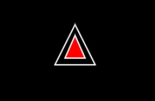
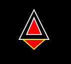
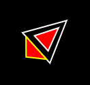
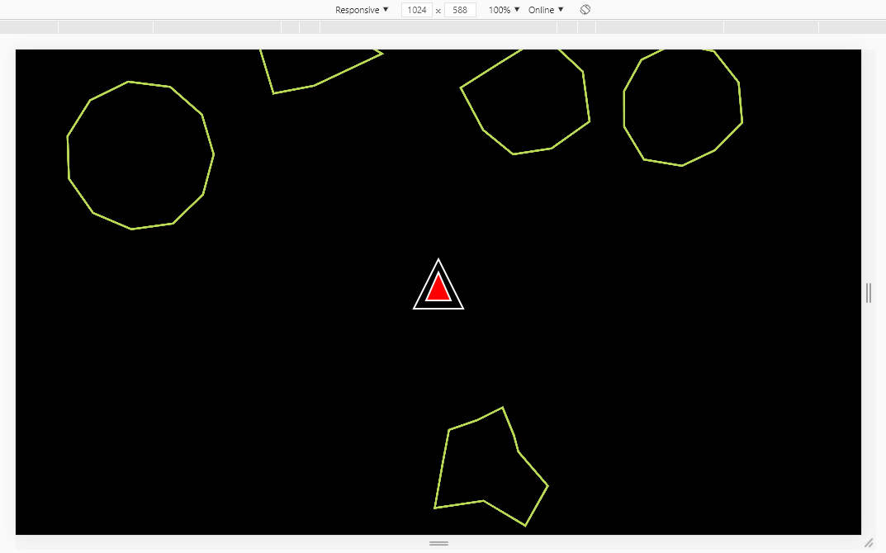
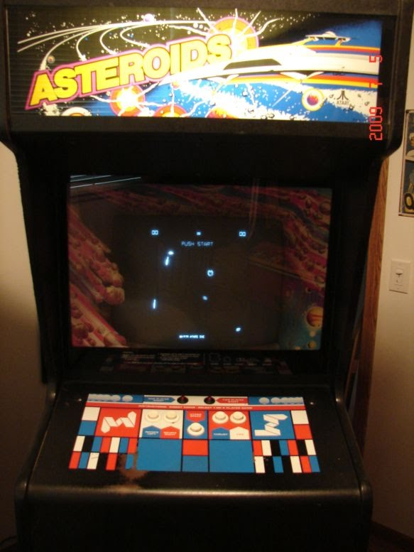
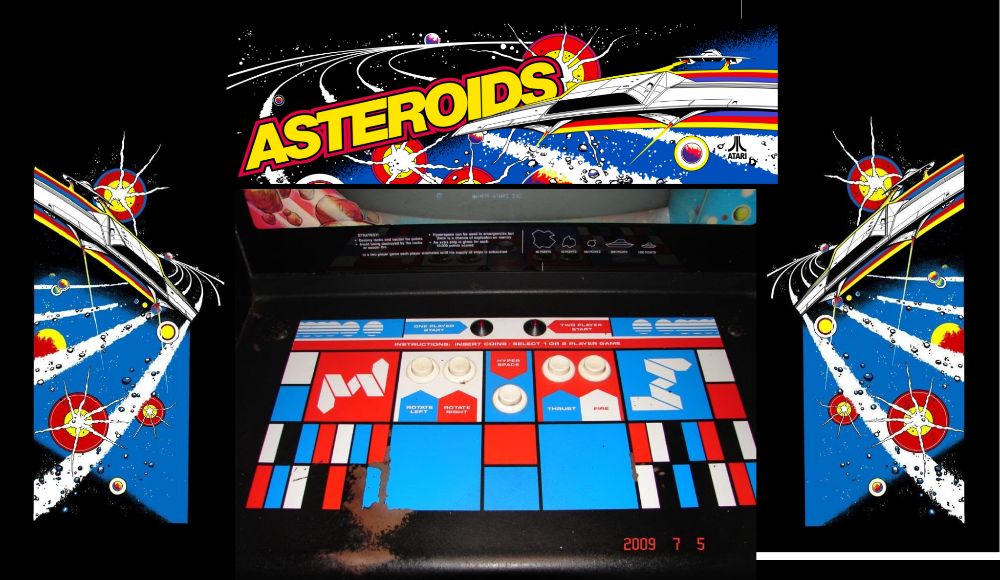
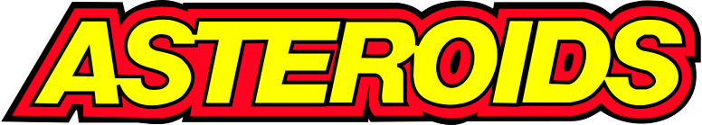

# An OOP guide to Creating an Asteroids Game using Vanilla JS
written by aFuzzzyBear.

I had came across this youtube video on how to create a game that is a childhood favourite of mine. The legendary Asteroids from Atari.[^1] 
<a href="http://www.youtube.com/watch?feature=player_embedded&v=H9CSWMxJx84
" target="_blank"></a>
I figured why the hell not, I am getting a bit better at Javascript why not give this a shot. Credits to the instructor for making a thoroughly enjoyable code-along video tutorial of this game. 

What made this particular tutorial 'enjoyable' was that the instructor was using methods and techniques that I wasnt *taught* perse. I have been following along using [MDN Docs](https://developer.mozilla.org/en-US/docs/Learn) and other's but predominately I am a fellow of the school of MDN. 
As I was going along with the instructor I was find myself in a bit of an uncomfortable space. Without sounding overly critical, the instructor was using pre-ES6 standards in the script. It wasn't written in 'strict mode' and had no Object Orientated Approach towards it. Plus I was only really half satisfied with the outcome, I was wanting more, and thus began  my climb up Mount Improbable 🗻. 

In a way this was what I have been learning whilst I have been meandering my way through the Javascript Mountain Range. So I figured as a challenge to make a similar program to what was demonstrated in the video but bring it up to spec using what I have learnt to date. 


## Lets Begin
I wish to let you know, I have made this script extremely verbose by using JSDocs [^2]. This commenting style has a lot of benefits not only readability but also with use inside IDE's. I comment on everything, trying make my code as close to English as possible, apart from the math, that is just the nature of maths unfortunately.  

Lets begin by getting the boilerplate stuff out the way.

We are going to be needing a `asteroidGame.html` file and a `game.js` script file within the same directory.

`asteroidGame.html` should look like this:
```html
<!DOCTYPE html>
<html lang="en">
<head>
    <meta charset="UTF-8">
    <meta name="viewport" content="width=device-width, initial-scale=1.0">
    <title>Asteroids Game</title>
</head>
<style>
    *{
        margin:0;
        padding:0;
    }
    canvas{
        display: block;
        position: relative;
        width: 100%;
        height:100vh;
        overflow: hidden;
        overflow-y: hidden;
    }
</style>
<body>
    <canvas id="gameCanvas">
        <p>Huh, your browser doesn't seem to support HTML5! Sorry bud,</p>
    </canvas>
</body>
<script src="game.js"></script>
</html>
```
Quickly explaining what is going on here. We have a couple of basic style rules to allow the game to be applied to the full size of the viewport. 
Within the `<canvas>` element we have a fall-back tag in case the browser doesn't support the canvas element. 
Now load the html file through your local dev server and have it open. This was we can see the work that will be done in the JS being reflected in the browser. 

Now the boilerplate for the `game.js` is a lot easier. At the top of the file we will be adding the 'Strict Mode' Command to the Global Environment, being at the top, this sets the rest of the script to adhere to following the ECMA - Standards of writing JavaScript. It should look like this: 
```javascript
'use strict'; //Placed on line 1
```


### Setup the Canvas

To set-up the canvas for the game, we first have to grab the canvas from the DOM. 
```js
const canvas = document.getElementById('gameCanvas');
```
Next we set-up the context for the canvas, stating that we will be using a 2-Dimensional context instead of a 3-Dimensional one like *webGl*. **
```js
const ctx = canvas.getContext('2d');
```


### Setting up the Animation Loop
Now lets get something on the screen. To do this we will be using the `window.requestAnimationFrame API`[^3] here the original tutorial had setup their own animation loop using `setInterval()` running at 30 fps which was creating a horrendous amount of *janking* motion when it was rendering. But by using the `requestAnimationFrame` the performance of the script was notably improved but it  forced my hand to having to do the tutorial in a completely different way.

```js
//place this at the bottom of the script
function gameAnimationLoop(){
    //Draw the Background -Space
    ctx.fillStyle = "black";
    ctx.fillRect(0,0,width,height);

    //Do other stuff here


    //Request animation frame
    requestAnimationFrame(gameAnimationLoop)

}
//Starting the Game Animation
gameAnimationLoop();
```

You should have a black screen that occupies the full viewport.

Next up we will be adding some functions that we will be needing throughout the script in various places so we will put them in the global scope.

## Functional Programming side of the Script

I like to keep the global variables and functions right at the top of the script. 
We will be rarely be adding to it as we go. So its good to understand where to put the stuff that belongs in the global scope.

For the script we would be needing to reuse a lot of repetitive maths. Im calling this part the 'Functional side' simply because it's as **PURE** as I can get it. The basic concept of Functional programming is that they take an input do something that will deliver the same output all the time. Keeping it pure means that once they are set their output is what we can depend on when we use them around the script...

#### Random Number Generator

Javascript has a built in 'random' number generator but its not really easy to work with. For starters the [`Math.random()`](https://developer.mozilla.org/en-US/docs/Web/JavaScript/model/Global_Objects/Math/random) returns a long tailed decimal point number between 0 and 1, now that is fine if you wanted a random decimal number. But it would require to be scaled according to use. 

So we would be making our own Random number Generator, that would return a whole number within a given range of numbers. 

Another Random Decimal Number Generator where we would be curtailing the number of decimals places to save some memory overhead and reap whatever marginal performance gains that I had read about. We would be using this to preform a couple of different purposes but one is that its really hand to determine if something should be a positive integer or a negative value.


```js
/**
 * @function RandomNumber Generator
 * @param {Number} min -Lowest Number in Range
 * @param {Number} max  - Highest Number in Range
 * @returns Random Number between the range of min - max
 */
function randomNumber(min,max){
    return Math.floor(Math.random()*Math.floor(max-min) + min)
}
```
Here we are creating the function that would return a random number between two arguments. This way we can generate a random number between a range of numbers, say 1-10 or 0-255 etc and it would give a random number when invoked. 

#### Random Decimal Number Generator
```js
/**
 * @function randomNumberDecimal Number
 * @returns Random Decimal number fixed to 4 decimal places. 
 */
function randomNumberDecimal(){
    return +Math.random().toPrecision(4)
}
```
Here we are ensuring that the return value is an integer(number) by using the ternary `+` symbol. You can try this in the console:
```js
let a = '10';
console.log(a) // ''10''
typeof(a) //"string"
let b = +a
console.log(b) // 10 
typeof(b) //"number"
```
Next because we want to for a couple of reasons that i have already eluded to is curtailing the amount of decimal numbers generated, so we fix it to 4 decimal places. Which is sufficiently long to be random and small enough that it wouldn't take up extra memory when computing. 

#### Convert to Radians

```js
/**
 * @function convertRadians
 * @param {Number} degrees in Decimal
 * @returns Degrees in Radians
 */
function convertRadians(degrees){
    return +(degrees / 180 * Math.PI)
}
```
Javascript likes radians, as it turns out. [^4]. This will save a lot of unnecessary math overhead when we start making the ship rotate clockwise and counter-clockwise. 

#### Working out the Distance between Objects

These two functions carry out a similar purpose to each other. The long and short of it is we will be working out the distance between two points using cartesian geometry.[^5]

```js

/**
 * @function distanceBetweenPoints
 * @description
 * Takes the cartesian distance between two points A(x,y) and B(x,y) 
 * 
 * @param {Number} x1 - X - Co-ordinate of the Primary Object
 * @param {Number} y1 - Y - Co-ordinate of the Primary Object
 * @param {Number} x2 - X - Co-ordinate of the Secondary Object
 * @param {Number} y2 - Y - Co-ordinate of the Secondary Object
 * @returns Distance in Pixels
 * 
 */
function distanceBetweenPoints(x1, y1, x2, y2) {
    return Math.sqrt((x2 - x1)** 2 + (y2 - y1)**2)
}
```
The next function takes the same principles and apply it to circles [^6]. Here we are taking the distance between two points and subtracting it of the sum of the radius of the two circles, we are also trying to keep the number as neat as possible.

```js
/**
 * @function distanceBetweenCircles
 * @param {Number} x1 - X - Co-ordinate of the Primary Object
 * @param {Number} y1 - Y - Co-ordinate of the Primary Object
 * @param {Number} r2 - R - Co-ordinate of the radius of the Primary Object 
 * @param {Number} x2 - X - Co-ordinate of the Secondary Object
 * @param {Number} y2 - Y - Co-ordinate of the Secondary Object
 * @param {Number} r2 - R - Co-ordinate of the radius of the second Object 
 * @returns 
 * Returns the distance between two circles 
 */   
function distanceBetweenCircles(x1,y1,r1,x2,y2,r2){
    return Math.ceil(Math.sqrt((x2 - x1)**2 + (y2-y1)**2) - (r2+r1))
}
```

Now that is the Global Scope populated with the few functions that we will be needing through in the script. 

Lets quickly discuss some of the technical commitments that I had to take in order to create what I thought the summit would look like. In my head I wished for a game, a replica of the game that I played as kid. I wanted to remember that feeling of piloting a small spacecraft through the asteroid belt. Growing older does make the nostalgic stronger. So I was wanting a start screen, a highscores screen, a game screen and a few other things in between. 

This leads us to undertake what is known as a Model-View-Controller design paradigm.[^7] The central tenants of this design pattern is that the model holds the components of the applications structures and patterns. 
It is the data-structures that we will be using that is independent of the user interface. It manages and directs the data based on predefined logic and methods set by the model. 
By this I mean that we would be using a model to hold reference to the game: its variables and methods. We would also have a model for the ship and asteroids as these are independent data structures that would be controlled by their respective models. 

The View is the visual representation of the data within the model. There can be multiple views supported from the main model, we will be using this to develop the game screens.

The controller which accepts the input from the user provides the interface to determine which game view would be used and manipulating the data sent to the model. 

This design patter fits within the scope of what we are trying to accomplish. In order to really achieve this MVC design we would be using a Object Orientate Approach to our game. Another technical tangent to the original script. At this point the original script from the tutorial was running parallel to the direction I was undertaking. and the similarities between our two scripts started to feel foreign between each other. 

## Setting up the Game Objects Classes

So in order to keep with a strictly Object Orientated Approach [^8] to making this Asteroids game, we need to create some parent models or classes for our objects.

The best way to approach this is by breaking up the objects that we will be having into common properties and what is exclusive to itself. 

Lets break this out: 

 1) We need to keep a single point of truth for a lot of the game variables that we would be using repetitively throughout the script. There would also be methods(functions) that would be solely specific to the game and not related to either the spaceship or asteroids. If anything they should be able to access this as a model.
   [see class GameModel](#class-gamemodel).
 2) We need to have a shared object that would hold similar properties that would be between both the spaceship and the asteroids. From this we can then build out each object
   [see class BasicObject](#class-basicobject)
 3) Building a object literal for the spaceship and asteroids respectively. Each would have methods that would be relevant to them. Keeping the methods of these objects separate. 
   [see class ShipObject](#class-shipobject)
   [see class AsteroidObject](#class-asteroidobject)

### class GameModel
First up we are going to create a parent class(object literal) for all the game constants and variables that we would be using. The original tutorial has these *cluttering* the global scope which makes it awfully cumbersome. By moving these to an object we would be making it easier to reference and manage these variables in the game.

First up we would need to get the width and height of the canvas and have this automatically update every time the window is resized. This keeps the canvas elements inside the canvas respective of the viewport as it changes sizes. I would say trust me, by getting this out early doors we can work with a more pixel sharp and responsive canvas. Which is to the benefit of the greater good. 

We would be using the `getter` accessor method [^9] if you are unfamiliar with it, this is a great introduction.
```js
class GameModel{
    constructor(){
        /**
        * @this this._width - Private width variable that would store the size of the window width
        */
        this._width = Number();
        /**
         * @this this._height - Private Height variable that would store the height of the window
         */
        this._height= Number();
        
        /**
         * Calls the getCanvasDimensions method
         */
        this.getCanvasDimensions();
        //Getting the Width and Height as soon as the Window loads
        window.addEventListener('load',()=>{
            this.getCanvasDimensions()
        })
        //As the window is resized we are getting the new Canvas Dimensions
        window.addEventListener('resize',()=>{
            this.getCanvasDimensions();
        })
       
    }
    /**
     * @method getCanvasDimensions
     * @description Obtains the Width and Height of the canvas respective to the viewport and the device's own pixel density. This is to provide accurate values for rendering the elements ont he canvas
     */
    getCanvasDimensions() {
        // Width is determined by the css value for the viewport width this is then respected by the device pixel ratio. This is then used to set the canvas.width value
        this._width = Math.round((Number(getComputedStyle(canvas).getPropertyValue('width').slice(0,-2))/devicePixelRatio) * devicePixelRatio);
        //Setting the canvas width 
        canvas.width = this._width
        
        // height is determined by the css value for the viewport height this is then respected by the device pixel ratio. This is then used to set the canvas.height value
        this._height = Math.round((Number(getComputedStyle(canvas).getPropertyValue('height').slice(0,-2))/devicePixelRatio) * devicePixelRatio);
        //Setting the canvas height
        canvas.height = this._height
        
    }
    
    /**
     * @this this.width - Returns the width of the canvas
     */
    get width(){
        //This sets the width to the private _width value
        return this._width
        
    }
      /**
     * @this this.height - Returns the height of the canvas
     */
    get height(){
        //This sets the height to the private _height value
        return this._height
    }

    }
}

```
There is a couple of things happening here that is worth commenting on. First we set internal `this` properties for the width and height. The purpose being is that these update as the window loads up, so it doesn't have a `null` value. We place a method call within the constructor function as we need to establish that the method call `getCanvasDimensions` is called when it the object is created. Secondly we place event listeners again within the constructor to re-obtain the new width and height value as the window resizes. 

We then use the `get` accessor function which lets us *get the new value* when it is called. This is all done in the name of responsiveness. We will see exactly how it looks soon once we start drawing the spaceship.

Next we are going to be instantiating this new object literal to something that we can now model, and that is what we are calling it.
```js
let model = new GameModel()
```
</img>
This looks right, now go ahead and resize the window and `console.log(model.width)` and `console.log(model.height)` respectively. Notice how it presents the new sizes as the window changes. (This was a huge win for me, three canvas projects later and I finally fix this bug! 💪)

As we begin to develop the game out we will be adding to this Object Class with additional properties.

Now since we are using `requestAnimationFrame()` API we need to understand something about it. It is a magical recursive loop, that doesn't break your computer. But as it does its looping it does so at an inconsistent rate, this is often client-machine dependant. So in a single second, 1000ms the recursive loop will go over itself anywhere between 1000-100 times in a second. Each time it does it re-draws the *scene* or *frame*. Each *frame* is a snapshot of the programs recalculations. Doing it this fast can send a lot of the calculations out off whack, as each scene is being updated it recalculates(re-executes) all the object values to show their new position on each frame. 

To balance this out we set a property to indicate the number of frames to execute each second. This gives our animation a steady frame rate, of each frame being executed 1/60th of a second or 16.6ms. So that's one new frame every 16.6ms, which is easier for the calculations which we will be doing. 

So in the `class GameModel` constructor function add this with the other `this.` properties. 
```js
        /**@this this.FPS - Frames per Second */
        this.FPS = Number(60)
```

### class BasicObject
This is a shared parent object literal class that would contain the most basic shared properties between the spaceship and the asteroids. This is straight forward:

```js
class BasicObject{
    /**
     * 
     * @param {Number} x - Position of Object on X - Axis 
     * @param {Number} y - Position of Object on Y - Axis
     * @param {Number} r - Radius of the Object
     * @param {Number} a - Angle of the Object (in deg)
     */
    constructor(x,y,r,a){
        /**
         * @this this.x -  Position of the Object on the X - Axis
         */
        this.x = Number(x);
        /**
         * @this this.y -  Position of the Object on the Y - Axis
         */
        this.y = Number(y);
        /**
         * @this this.r -  Radius of the Object
         */
        this.r = Number(r);
        /**
         * @this this.a - Angle of the Object - converted to Radians
         */
        this.a = convertRadians(a); //Converted to Radians

    }
}
```
Really this would save us repeating these properties as we create the spaceship and the asteroids. 

### class ShipObject
Right now lets do something fun.  For this class we will be building up over time. We will be adding new properties to it as we make the ship more complex. 

We will be looking to make the following spaceship.
    </img>.

To do this lets first extend the `BasicObject` class to start incorporating some of the properties that we need for building our spaceship.
#### Setting up the Object Literal
```js
class ShipObject extends BasicObject{
     /**
     * @constructor
     * @param {Number} x - Position of Object on X - Axis 
     * @param {Number} y - Position of Object on Y - Axis
     * @param {Number} r - Radius of the Object
     * @param {Number} a - Angle of the Object (in deg)
     * @param {Number} rot - 360/deg of turning
     * @param {Boolean} thrusting - Flag- Registers if the ship is thrusting is active
     * @param {Object} thrust - Object contains the thrust vectors for the Ship
     */
    constructor(x,y,r,a,rot,thrusting,thrust){
        super(x,y,r,a)//Inheriting the Properties from the Parent Object
     
        /**
         * @this this.rot - Ship can only rotate around 360deg of a circle  converted to Radians
         */
        this.rot = convertRadians(rot);//Converted it into Radians
     
        /**
         * @this this.thrusting - Boolean Flag! True when the ship trust is active
         */
        this.thrusting = Boolean(thrusting);
     
        /** 
         * @this this.thrust - Provides a vector for the ship when travelling
        */
        this.thrust = {...thrust};
     
        /**
         * @this this.SHIP_SIZE 
         * @description Height of the Ship in px's - Same as the Radius
         */
        this.SHIP_SIZE = Number(r);
     
        /**
         * @this this.Friction 
         * @description Adds a Friction co-efficient to the movement of the ship:Friction in Space (0 = no friction, 1 = 100% friction)
         */
        this.FRICTION = Number(0.5); 
        
        /**
         * @this this.SHIP_THRUST 
         * @description Acceleration of the Ship, in px/sec^2
         */
        this.SHIP_THRUST = Number(2); // acceleration of the Ship, px/sec^2
     
        /**
         * @this this.TURN_DEG
         * @description This is the turning angle in deg/sec. 
         */
        this.TURN_DEG = Number(360); // Turns in deg/sec


    }
    //Methods Go Here
}
```
Quick note: I have kept the **constants** that the ship would be using like typed in Upper-case, which is just to make it easier to know what is a variable and a constant. 
```js
this.SHIP_SIZE
this.FRICTION
this.SHIP_THRUST
this.TURN_DEG
```


To instantiate the object we will be calling it using:

```js
//On the Global scope for the time being
let spaceship = new ShipObject(
    model.width /2,
    model.height/2,
    30,
    90,
    360,
    false,
    {x:0,y:0}
);
```
This should produce the following when `console.log(ship)` (x & y values will be somewhat different)-(it was originally called `ship`🚢, this got changed to `spaceship`🚀)
</img>

Awesome, we have gotten our object made up with little to no complications what-so-ever. 😑 

#### Draw method
Now lets draw this spaceship on the screen.

First we would want to create a draw method on the ShipObject's prototype chain. 
```js
class ShipObject{
    //methods
    draw(){
       //ctx styles
       ctx.strokeStyle = 'white'
       ctx.lineWidth = 2;
       //The outer Triangle
       ctx.beginPath();
       ctx.moveTo(
           //Nose of the spaceship

            this.x + 4 / 3 * this.r * Math.cos(this.a),
            this.y - 4 / 3 * this.r * Math.sin(this.a)
        );
        ctx.lineTo( // rear left
            this.x - this.r * (2 / 3 * Math.cos(this.a) + Math.sin(this.a)),
            this.y + this.r * (2 / 3 * Math.sin(this.a) - Math.cos(this.a))
        );
        ctx.lineTo( // rear right
            this.x - this.r * (2 / 3 * Math.cos(this.a) - Math.sin(this.a)),
            this.y + this.r * (2 / 3 * Math.sin(this.a) + Math.cos(this.a))
        );
    
        ctx.closePath();//Finishes of the Outer Triangle
        ctx.stroke();

        //Drawing the Cockpit
        ctx.beginPath();
        ctx.fillStyle = 'red';
        ctx.lineWidth = 2;
        ctx.moveTo( // top of the cockpit
            this.x - (1 / 5 * this.r - this.SHIP_SIZE) * Math.cos(this.a),
            this.y + (1 / 5 * this.r - this.SHIP_SIZE) * Math.sin(this.a)
        );
        ctx.lineTo( // rear left of the cockpit
            this.x - this.r * (1 / 3 * Math.cos(this.a) +  0.5 * Math.sin(this.a)),
            this.y + this.r * (1 / 3 * Math.sin(this.a) - 0.5 * Math.cos(this.a))
        );
        ctx.lineTo( // rear right of the cockpit
            this.x - this.r * (1 / 3 * Math.cos(this.a) -  0.5 * Math.sin(this.a)),
            this.y + this.r * (1 / 3 * Math.sin(this.a) + 0.5 * Math.cos(this.a))
        );
        ctx.fill();//Fill in the Shape
        ctx.closePath();//Finishes of the Triangle
        ctx.stroke();
        //More to be added....
    }

```
Now to have the ship drawn on the screen we would invoke this method within the [gameAnimationLoop](#setting-up-the-animation-loop) Loop. 
```js
//Game Animation Loop
function gameAnimationLoop(){
    ctx.fillStyle = 'black'
    ctx.fillRect(0,0,model.width,model.height);
    //Drawing the 🚀
    spaceship.draw();


    //Request animation frame
    window.requestAnimationFrame(gameAnimationLoop)
}
gameAnimationLoop()
```
You should have an object now appear on the canvas that should look very similar to this image of the spaceship.
</img>👍

#### Making the ship move
Now we want to make the ship move about. If you noticed we created a `thrusting` flag, which just records if the ship's thrust is On or Off. We can use these flags to determine when to switch a feature on and off. in this case we would using it to instruct the model to update when the ship the thrust is active, which would be seen as:

We would also need to rotate the ship clockwise and counter-clockwise. This would be controlled by keyboard inputs which we would make up second.
</img>

</img>
But first lets make the functionality for the spaceship to fly around space.
Back in the `draw()` method we will add this block of code:

```js
class ShipObject{
    //methods
    draw(){
        ... 
        if(this.thrusting){
            //Add Thrust vector 
            this.thrust.x += this.SHIP_THRUST * Math.cos(this.a) / model.FPS **1/2;
            this.thrust.y -= this.SHIP_THRUST * Math.sin(this.a) / model.FPS **1/2 ;
            //Draw thrust animation
            ctx.beginPath();
            ctx.strokeStyle = "yellow";
            ctx.fillStyle = "red"
            ctx.lineWidth = 2;
            ctx.moveTo( // rear center behind the spaceship
                this.x - 4 / 3 * this.r * Math.cos(this.a),
                this.y + 4 / 3 * this.r * Math.sin(this.a)
            );
            ctx.lineTo( // rear left
                this.x - this.r * (2 / 3 * Math.cos(this.a) +  0.75 * Math.sin(this.a)),
                this.y + this.r * (2 / 3 * Math.sin(this.a) - 0.75 * Math.cos(this.a))
            );
            ctx.lineTo( // rear right
                this.x - this.r * (2 / 3 * Math.cos(this.a) -  0.75 * Math.sin(this.a)),
                this.y + this.r * (2 / 3 * Math.sin(this.a) + 0.75 * Math.cos(this.a))
            );
            ctx.fill();//Fill in the Shape
            ctx.closePath();//Finishes of the Triangle
            ctx.stroke();
        }
        
        //Applying Friction to slow down the spaceship when Not thrusting
        if(!this.thrusting){
            this.thrust.x -= this.FRICTION * this.thrust.x /model.FPS
            this.thrust.y -= this.FRICTION * this.thrust.y /model.FPS
            
        }
        //Rotate spaceship

        this.a += this.rot
        //Move the spaceship
                    
        this.x += this.thrust.x;
        this.y += this.thrust.y;

        //Handle screen edges
```
Now lets get the event listeners setup. For the present we will be applying this logic currently to the `GameModel` In the `GameModel` literal we will create two methods, one to handle the key-down press event and one as we release the key or the key-up press event. As we press down we will active the thrust and rotate the ship, and as we release we want to stop the thruster and rotation, else they would just continue to be on.

```js
class GameModel{
    //methods
    keyDown(event){
            
        if(event.key === 'ArrowUp' || event.key === 'w'){
            //Start Thrusting
            spaceship.thrusting = true
        }
        if(event.key === 'ArrowRight' || event.key === 'd' ){
        //Rotate Right
        spaceship.rot = -convertRadians(spaceship.TURN_DEG) / model.FPS
        }
        if(event.key === 'ArrowLeft' || event.key === 'a' ){
        //Rotate Left
        spaceship.rot = convertRadians(spaceship.TURN_DEG) / model.FPS
        
        }
        
    }
    keyUp(event){
        if(event.key === 'ArrowUp' || event.key === 'w'){
            //Stop Thrusting
            spaceship.thrusting = false
        }
        if(event.key === 'ArrowRight' || event.key === 'd' ){
            //Stop Rotating
            spaceship.rot = 0;
        }
        if(event.key === 'ArrowLeft' || event.key === 'a' ){
            //Stop Rotating
            spaceship.rot = 0;
        }
    }

```
To add these event listeners we do so just above the `gameAnimationLoop` loop at the bottom of the script. 

```js
document.addEventListener('keydown',model.keyDown)
document.addEventListener('keyup',model.keyUp)
```
Now you should have your spaceship moving and zooming about that screen 😊.

#### Handle screen edges
But we have a problem as the ship moves off the screen it doesn't appear on the opposite side of where it exited. This is a problem that can be fixed by adding a method on the `GameModel` Object that would handle for screen edges.

```js
class GameModel{
    //methods
    screenEdges(obj){
        if(obj.x < 0 - obj.r){
            obj.x = this.width + obj.r
        }
        else if(obj.x > this.width + obj.r){
            obj.x = 0 - obj.r
        }
        if(obj.y < 0 - obj.r){
            obj.y = this.height + obj.r
        }
        else if(obj.y > this.height + obj.r){
            obj.y = 0 - obj.r
        }
    }  
```
Here we will be passing in different objects like the spaceship and asteroids and as such we will be calling on this function a lot.

Back in the `draw()` method we have setup we will apply this statement at the bottom

```js
        //Handle screen edges
        model.screenEdges(this)

```
Now you the spaceship should reappear on the opposite side of where it entered. Now we are flying 🚀.

The spaceship object is pretty complete for now, we will come back and add other functionality like; lasers and collision detection etc.

### class AsteroidObject

Now to the namesake of the game.  Firstly we need to create an asteroid field, where each asteroid would randomly appear on the screen and have their own respective vectors which lets them follow a path across each frame. They also should be able to collide with each other and ricochet of each other. We would also need to be able to destroy them completely and replace them with smaller fragments. 

But before we do anything that remotely complicated, we need to create our Asteroid Object literal. This literal will describe the properties that we would be using for each asteroid. 

```js
class AsteroidObject extends BasicObject {
    constructor(x,y,r,asteroidIndex){
        super(x,y,r)
        /**@this this.a - returns a random angle in radians */
        this.a = Math.random() * Math.PI * 2
        
        /**@this this.vX - random Velocity on the x-axis  */
        this.vX =randomNumber(15,30)/model.FPS * (randomNumberDecimal() <0.5 ? 1 : -1)
        
        /**@this this.vY - random Velocity on the y-axis  */
        this.vY = randomNumber(15,30)/model.FPS * (randomNumberDecimal() <0.5 ? 1 : -1)
        
        /**@this this.vertices - Random number of vertices for the polygon to be generated */
        
        this.vertices =Math.floor(randomNumber(2,8) + randomNumber(2,8)),//Each asteroid has a random number of vertices
        
        /**@this this.jaggedness - random determination on the amount of jaggedness on the asteroid */
        this.jaggedness = randomNumberDecimal(), // 0 = none 1 = 100
        
        /**@this this.offsets - Array of positions for the dimensions of the polygon */
        this.offsets = []
        
        /**@this this.asteroidIndex - Asteroid Index position in the Array */
        this.asteroidIndex = Number(asteroidIndex);
    }
}
```

Here we are going to be setting the asteroid x,y and radius separately, this way we can give them random values at run-time. We will come back to this. Next we are setting the `vX` & `vY` using a random number that would depending on the logic condition would either appear to be a positive integer or a negative integer. You may notice that I have an `astroIndex` which doesn't get used anywhere in the script. I  had introduced this to help with a few debugging issues where I had to label each asteroid to study their behaviour for a time. 

Because we are wanting some of the asteroids are going to be jaggy and sharp and others to be smoother random polygons we need to have a few extra variables to hold such patterns.

#### Creating Asteroid Field
Now lets create an asteroid field. Since this is a feature of the game, we would be placing this next method on the `GameModel` prototype chain. 

```js
class GameModel{
    createAsteroidField(numberOfAsteroids){
        
        //clear the existing array
        this.asteroidField = new Array();
        //creating place holders
        let x,y,r,i

        for(let index = 0; index< numberOfAsteroids; index++){
            x = randomNumber(0,this.width)
            y = randomNumber(0,this.height)
            r = randomNumber(60, 100);
            //Giving the asteroid a Label - Done purely for debugging purposes
            i = index

            //Creating a buffer zone around the ship to prevent the asteroids randomly spawning on the ship
    
            if(distanceBetweenPoints(spaceship.x,spaceship.y,x,y) <= spaceship.r * 5 + spaceship.r){
                x = randomNumber(0,this.width) + (spaceship.x + spaceship.r + 20);
                y = randomNumber(0,this.height) + (spaceship.y + spaceship.r + 20);
            }
            this.asteroidField.push(this.createNewAsteroid(x,y,r,i))
        }
        return this.asteroidField
    }

    createNewAsteroid(x,y,r,asteroidIndex){
        let asteroid = new AsteroidObject(x,y,r,asteroidIndex);
        //Setting the values for the asteroids jaggedness
        for(let offset = 0; offset < asteroid.vertices; offset++ ){
            asteroid.offsets.push(
               Math.random() * asteroid.jaggedness * 2 + 1 - asteroid.jaggedness
            )
        }
        return asteroid
    }
}
```
These method will create a number of asteroids from a parameter which we can change throughout the script.  This will come in handy when we want to create more asteroids. 
We are also creating a buffer zone around the ship where if the asteroid spawns near a radial distance to the ship, it would be relocated to somewhere else in space and kept a distance away. 
We then push each newly created asteroid object to the `asteroidField` which is an array of asteroid objects.
To call this method we place it for the time being on the global scope.
```js
//placed ideally just above the Animation Loop
model.createAsteroidField(5)
```
#### Draw Method

The asteroids themselves each has their own draw method. This method is on the `AsteroidObject` prototype chain. Here we are instructing it to draw a polygon based on the values in the `asteroid.offset` array. This gives each asteroid their own unique shape. Reminiscent of the uniqueness of snowflakes. 

```js
class AsteroidObject{
    //methods
    draw(){
            //Draw Asteroids
            ctx.strokeStyle = '#BADA55';
            ctx.lineWidth = 2;
            ctx.fillStyle = 'transparent';
            //draw a path
            ctx.beginPath();
                ctx.moveTo(
            this.x + (this.offsets[0]  * this.r) * Math.cos(this.a),
            this.y + (this.offsets[0]  * this.r) * Math.sin(this.a)
            )
            //draw the polygon and jaggedness for each asteroid
            for(let polygon = 1; polygon < this.vertices; polygon++){
                ctx.lineTo(
                    this.x + (this.offsets[polygon] * this.r) *  Math.cos(this.a + polygon * Math.PI * 2 / this.vertices),
                    this.y + (this.offsets[polygon] * this.r)*  Math.sin(this.a + polygon * Math.PI * 2 / this.vertices)
                    )
                }
            ctx.fill();
            ctx.closePath();
            ctx.stroke();

            //handle collision detection
            
            //move asteroid
            this.x += this.vX
            this.y += this.vY
            
            
            //handle edge of screen
            model.screenEdges(this)
    }

```

To call this function in the Animation Loop we will add the following `Array.forEach()` loop.

```js
//Global Scope-At the Bottom of the Script
function gameAnimationLoop(){
    ctx.fillStyle = 'black'
    ctx.fillRect(0,0,model.width,model.height);

    spaceship.draw();

    //Drawing each asteroid on the screen
    model.asteroidField.forEach((asteroid)=>{
        asteroid.draw()
    })


    //Request animation frame
    window.requestAnimationFrame(gameAnimationLoop)
}

```
Now you should have a set of randomly assorted asteroids, all floating about the screen 😍



Now we can start building a game.

##Building out the Game

Here we are going to be adding more functionality to the game, these are things that I thought: 'that would be cool to have.' 

And so this project has naturally grown arms and legs of its own. 

The things we would be adding to this would be:
1) collision detection between:

   - ship and asteroid: where the ship is blown up. We would have an exploding animation. It should decrease the game lives counter by one. 
    -asteroid and asteroid: where each asteroid if it collides with another it should ricochet off each other and go in different directions. 
2) Lasers 
    - shooting and blowing up each asteroid into smaller pieces. Keeping a score as each asteroid is breaking up. If the pieces break into smaller fragments, once they reach a certain size they disappear. 
  
3) Keep a score and a Lives counter. Game ends when the player runs out of lives. Levels increase if the player is still alive and their is no more asteroids left.

(Ill add more here as we go, something about it growing arms and legs)


### Collision Detection

Remember the [`distanceBetweenPoints()`](#working-out-the-distance-between-objects) and [`distanceBetweenCircles()`](#working-out-the-distance-between-objects) that we created in the global space. This is where we would start to utilize these functions.

#### Asteroid
To see if a collision has happened we are checking if the distance between two asteroids is less than the radius of the asteroid about to collide. If it does we will change the vector values for both the asteroids in question. 
In the `AsteroidObject` methods chain we will add this code block that pretty much does that with little *Jank*.
```js
class AsteroidObject{
    //methods
    asteroid2asteroidCollision(){
        let currentAsteroid = this;
        model.asteroidField.forEach((otherAsteroid)=>{
            if(currentAsteroid != otherAsteroid){
                if(distanceBetweenCircles(currentAsteroid.x,currentAsteroid.y,currentAsteroid.r,otherAsteroid.x,otherAsteroid.y,otherAsteroid.r) < currentAsteroid.r + currentAsteroid.x ){
                    //Make the asteroids 'softly' ricochet off each other
                    //There has been many different attempts at getting this right, this is by far the best attempt at getting the asteroids to move off and change direction and their velocity that produces the least amount of Janking
                        
                        currentAsteroid.vX = currentAsteroid.vX/( (model.FPS / 2))  + Math.sin(-currentAsteroid.a) 
                        otherAsteroid.vX = otherAsteroid.vX/ (model.FPS / 2)  + Math.sin(-otherAsteroid.a) 

                        currentAsteroid.vY = currentAsteroid.vY/ (model.FPS / 2)  + Math.cos(-currentAsteroid.a)  
                        otherAsteroid.vY = otherAsteroid.vY/ (model.FPS / 2)  + Math.cos(-otherAsteroid.a)
                    //This was easy...😑

                }
            }
        })
    }
```
We are using the `forEach()` array iterator to check if the asteroid that is currently being drawn in that frame is not the same as every other asteroid.
We then check if the distance between the asteroids is less than the asteroid radius that is colliding with it , meaning that they are overlapping at the radial point of each asteroid. We are then changing the velocity of both asteroids respective of the framerate and their angles. We then switch between positive and negative integers depending on a random value. 

To instantiate this method every time the asteroid is drawn we place it within the `AsteroidObject.draw()` method. 

```js
class AsteroidObject{
    //methods
    draw(){
        ... 
        ctx.stroke();
       
       //Handle collision Detection
        this.asteroid2asteroidCollision()
        this.asteroid2shipCollision()    

        //move asteroid
        this.x += this.vX
        this.y += this.vY
        
        //handle edge of screen
        model.screenEdges(this)
    }
```
To really test this new method it would be good to increase the number of asteroids in the asteroid field to something like 15 just to fill up the screen, tbh you can play with this value as much as you wish
`model.createAsteroidField(15)`


#### Ship
To detect if the Ship has collided with an asteroid we will need to register a `spaceship.exploding` flag as true. For if the ship is exploding we would want to draw an explosion animation. Then reset the ship's position to the center of the screen. (and reduce the lives's count by one...

To detect the asteroid 2 ship collision we would apply this method to the `AsteroidObject` chain. 
```js
class AsteroidObject{
    ...
    //methods
    asteroid2shipCollision(){
        if(distanceBetweenPoints(this.x,this.y,spaceship.x,spaceship.y) < spaceship.r + this.r && !spaceship.immune){
            // register that the ship is exploding 
            model.shipExploding = true
        }

    }
}
```
There is a few extra properties that had to be set to set this up. First in the `GameModel` Object literal we put this flag in.
```js
class GameModel{
    constructor(){
        ...
        /**@this this.shipExploding - Registers a flag if the ship is exploding */
        this.shipExploding = false
```

```js
class ShipObject{
    //constructor
    constructor(...){
        /**@this this.immune - Immunity from Explosions Flag */
        this.immune = Boolean(false)
    }
    //methods 
    explodeShip(){
        //Prevent the ship from moving
       if(!this.immune){ this.thrust = {
            x:0,
            y:0
        }}

        //Drawing the Explosion
        ctx.beginPath();
        //Outermost circle - Dark Orange
        ctx.strokeStyle = '#db4200';
        ctx.fillStyle='#db4200'
        ctx.arc(this.x,this.y, this.r +10, 0, Math.PI * 2, false);
        ctx.fill()
        ctx.stroke();
        // n-1 circle - Orange
        ctx.beginPath();
        ctx.strokeStyle = '#f26900';
        ctx.fillStyle='#f26900'
        ctx.arc(this.x,this.y, this.r + 5, 0, Math.PI * 2, false);
        ctx.fill();
        ctx.stroke()
        // n-2 circle - Yellow
        ctx.beginPath();
        ctx.strokeStyle = '#f29d00';
        ctx.fillStyle='#f29d00'
        ctx.arc(this.x,this.y, this.r + 2, 0, Math.PI * 2, false);
        ctx.fill();
        ctx.stroke();
        
    }

}
```
This is the exploding animation function. We are basically instructing the `ctx` render engine to create three concentric circles to give the appearance of an explosion. Now we are going to set this to be active if the ship is registered as being *exploding* 
Once it explodes after a certain time limit we want it to re-spawn at the center of the screen. (also I would ideally like it to decrease a live but that is still proving tricky, mind you something could be said about the power of procrastination, if it wasn't for this problem and some others that has managed to of been resolved, like the janking collisions between asteroids I mean it was ugly for a while. And the resizing the screen, I cant tell you how chuffed I am still at this. So I still hold out hope yet, that by the time we get to that, I've of figured it out by then 🙊 )

Once the spaceship explodes we want to give it some sort of immunity from being destroyed for a period of time to let the user get somewhere safe before they are susceptible to being destroyed by an asteroid. 

So lets add a change to the spaceship, If it is immune it turns golden >? 
```js
class ShipObject{
    //methods
    draw(){
        //At the top
        if(this.immune){
                ctx.strokeStyle = "gold";
                ctx.fillStyle = "gold"
        }else{
            ctx.strokeStyle = "white";
            ctx.fillStyle = "red"
        }
        //Delete line 390
        ...
        //Drawing the Cockpit
            ctx.beginPath();
            // ctx.fillStyle = 'red';<---Delete this line
    }
```
This method is placed on the `GameModel` methods chain,
```js
class GameModel{
    //methods
    createNewSpaceShip(){
        if(spaceship){
            //Delete the existing spaceship 🚀🔥
            spaceship = null;
            
        }
        //Instantiating a new spaceship 🎆🚀
        let newSpaceship = new ShipObject(
            model.width /2,
            model.height/2,
            30,
            90,
            360,
            false,
            {x:0,y:0}
        )
         //Making the New Ship immune to Being Exploded
         newSpaceship.immune = true
         //Switch off the Exploding Flag
         model.shipExploding = false
        //This just makes sure we can move afterwards
         newSpaceship.thrusting =false
         return spaceship = newSpaceship;
    }
}
```
Okay everything should be set now to make it work. In the animation loop we write the following

```js
function gameAnimationLoop(){
    ...

    if(!model.shipExploding) {
            spaceship.draw()  
        }else{
            spaceship.explodeShip();
            //Timeout's to carry out these functions after a certain period of time.        
            setTimeout(model.createNewSpaceShip,1000)
            setTimeout(()=>{
            //Removing the ships immunity after 5 sec
                spaceship.immune = false
            },5000)

    } 
```
Using `setTimeout()` macro-promise we can do some time-delayed actions like, setting the explosion to last for 1 second, and then create a new spaceship. Once that promise is carried out we then look to remove the immunity from the ship after a period of 5 seconds... 

Hopefully all those flags we set work and you should have something that goes like this:
<figure>
  <video controls="true" allowfullscreen="true"  width="500" height = "300">
    <source src="./assets/video/asteroidswhatitshouldlooklikesofar.mp4" type="video/mp4">
        <p>Sorry but the video doesn't seem to be working...Ill have it loaded up somewhere and hopefully working at some point.</p>
    </video>
</figure>

### Lasers - shooting and blowing things up

We discussed when building out the game, what we would like from it. As awesome as it is, flying the spaceship across the screen and watching all that hard work come together. Lets make it do what the original game was amazing at doing and that was blowing up asteroids into even smaller asteroids and racking up high scores. 

#### Shooting the Lasers
Lets begin by making the lasers. First lets add some properties to the `ShipObject` These will be for storing the lasers as they are fired in an array. A flag to register the firing of lasers, and a distance they will travel that is respective of the screen width.
```js
class ShipObject{
    constructor(...){
        //Add these properties:
       /**@this this.laserStatus - Flag - Registers if the laser is actively shooting ON or OFF  */
        this.laserStatus = Boolean(true);
        /**@this this.laserArray - Array Element that would store each laser object as they are fired */
        this.laserArray = Array();
        /**@this this.laserDistance - Distance the Laser would travel in respects to the screen width; 0 < laserDistance < 1(width) */
        this.laserDistance = 0.5  
    }
}
```
Next we are going to create a `drawLaser()` method on the `ShipObject` chain.
```js
class ShipObject{
    ...
    drawLaser(){
        //Applying the lasers
        //Looping backwards through the laser array
        for(let laserIndex = this.laserArray.length-1 ; laserIndex >= 0; laserIndex-- ){
            //Calculate the distance travelled
            this.laserArray[laserIndex].distanceTravelled += 
                Math.sqrt(this.laserArray[laserIndex].vX**2 + this.laserArray[laserIndex].vY**2);

            if(this.laserArray[laserIndex].distanceTravelled > 
                    this.laserDistance * model.width)
                    {
                        this.laserArray.splice(laserIndex,1)
                     }
        }
        this.laserArray.forEach(laser => {
            //Draw each laser

            ctx.fillStyle = "red"
            ctx.beginPath();
            ctx.arc(laser.x,laser.y,this.SHIP_SIZE/8,0,Math.PI*2,false);
            ctx.fill();
            ctx.closePath();
            //move the laser
            laser.x += laser.vX
            laser.y += laser.vY

            //Handling the edge of screen adjustments for the laser
            //Slightly different to the screenEdges method
            
            if(laser.x < 0){
                laser.x = model.width
            }else if(laser.x > model.width){
                laser.x = 0
            }
            if(laser.y < 0){
                laser.y = model.height
            }else if(laser.y > model.height){
                laser.y = 0
            }
           
        })
        //Asteroid 2 Laser Collision Detection

    }
}
```

That is the method to draw the lasers, a few things to note in here, Firstly we are looping backwards through the array. [^10]. This is so the last laser that is fired appears at the end of the array. 

Here we are finding out the distance that the that is just fired laser and the rest of the laser objects in the array of lasers that were fired are less than half of the screen width. If they exceed the distance then we remove them from the array. 

By doing this backwards for loop we can make sure the lasers are being drawn in the order that they are fired. 

To draw them, we would instruct it to do so in the `ShipObject.draw()` method.
```js
class ShipObject{
    ...
    draw(){
        ...
        //Laser 
        this.drawLasers()

        //Rotate spaceship
        ...
    }
}
```
So far so good, now we need to come up with a method that would let us fire off the lasers, basically every time the space-bar is hit it would create a laserObject ( you could forgive me but we can effectively ignore creating this from it's own class Object-reason being that this object only contains properties that we are setting at run-time, there is nothing extra special about them, for they contain no methods or inheritance from another object). 
This laser object would be pushed to the laser array, where it would be removed after it has either travelled a certain distance proportionate to the half the width of the viewport.
```js
class ShipObject{
    ...
    shootLasers(){
        /**@var LASER_SPEED - Speed of the Laser in px/sec*/
        const LASER_SPEED = 500 
        /**@var LASER_MAX - Maximum number of laser objects that can be created */
        const LASER_MAX = 100 
        //create the laser object if it meets these conditions
        if(this.laserStatus && this.laserArray.length < LASER_MAX){
            this.laserArray.push({
                //Creating a laser object 
                //Shooting from the nose of the ship;
                x:this.x + 4 / 3 * this.r * Math.cos(this.a),
                y:this.y - 4 / 3 * this.r * Math.sin(this.a),
                //Applying the velocity
                vX: LASER_SPEED * Math.cos(this.a) / model.FPS,
                vY: -LASER_SPEED * Math.sin(this.a) / model.FPS,
                distanceTravelled:0//Tracks the distance of the laser travelling
            })
           
        }
        //Last laser in the Array
        if(this.laserArray.length >= LASER_MAX){
            this.laserArray.push({
                //Fire one last laser object 
                x:this.x + 4 / 3 * this.r * Math.cos(this.a),
                y:this.y - 4 / 3 * this.r * Math.sin(this.a),
                vX: LASER_SPEED * Math.cos(this.a) / model.FPS,
                vY: -LASER_SPEED * Math.sin(this.a) / model.FPS,
                distanceTravelled:0
            })
            //Resetting the array 
            this.laserArray = []
        }
    }
}
```
Lastly we are registering this to be activated once the space-bar event is occurring. In the `GameModel.keyDown(event)` method we will add this:
```js
class ShipObject{
    ...
    keyDown(event){
        ...
        if(event.key === ' ' || event.key === 'Spacebar' ){
            //shoot laser
            spaceship.shootLasers();
        }
    }
}
```

Now you should have a spaceship that can fly about space, in between asteroids that if they touch the ship it will do a small explosion and then re-spawn in the center of the screen. We then confer it some immunity and now we can fire small red balls as lasers towards these asteroids.

So far, still good?....

Next we will wanting to blowing up the asteroid into smaller components.

#### Blowing up the Asteroids
```js
class ShipObject{
    ...
    shootLasers(){
        ...
        //Asteroid 2 Laser Collision Detection
        for(let astroIndex = model.asteroidField.length-1; astroIndex >= 0 ; astroIndex--){
            //Grabbing the asteroids properties
            let asteroidX = model.asteroidField[astroIndex].x 
            let asteroidY = model.asteroidField[astroIndex].y
            let asteroidR = model.asteroidField[astroIndex].r
    
            //Looping backwards through the Laser array
            for(let laserIndex = this.laserArray.length-1; laserIndex >=0; laserIndex--){
                //Grabbing the laser properties
                let laserX = this.laserArray[laserIndex].x
                let laserY = this.laserArray[laserIndex].y
    
                if(distanceBetweenPoints(asteroidX,asteroidY,laserX,laserY) < asteroidR){
                    //remove the laser
                    this.laserArray.splice(laserIndex,1)
              
                    
                    //destroy asteroid 
                    model.destroyAsteroid(astroIndex)
    
                }
            }
        }
    }
}
```
Note that we have a method on the `model` chain called `destroyAsteroid(astroIndex)` this method is setup to break up the asteroids into smaller parts if the laser hits the center of the asteroid. It would break up into smaller parts until they reach a minimum size after which they would be removed from the asteroid Field. 
```js
class GameModel{
    //methods
    destroyAsteroid(index){
        // let asteroidCopy = asteroidsArray[index]
        let x = this.asteroidField[index].x;
        let y = this.asteroidField[index].y;
        let r = this.asteroidField[index].r;
    
        //split the larger asteroid into two when shot at
       if( r >50 && r <= 100 ){
           //Adding the size of the asteroid as the value to be added to the score
           this.currentScore += 20
           //Remove the asteroid that is shot at
           this.asteroidField.splice(index,1)
           //Create the smaller asteroid debris 
           this.asteroidField.push(this.createNewAsteroid(x,y,r/2,index + 1))
           this.asteroidField.push(this.createNewAsteroid(x,y,r/2,index + 2))
        }
        if( r >25  && r <50){
            //Adding the size as the asteroid as the value to be added to the score
            this.currentScore += 50
            //Remove the asteroid that is shot at
            this.asteroidField.splice(index,1)
            //Create the smaller asteroid debris 
            this.asteroidField.push(this.createNewAsteroid(x,y,r/2,index + 1))
            this.asteroidField.push(this.createNewAsteroid(x,y,r/2,index + 2))
            
       }
       if( r <= 25){
           //Adding the size as the asteroid as the value to be added to the score
           this.currentScore += 100
           //Remove the smallest asteroid 
           this.asteroidField.splice(index,1)
       }
       
    }
}
```
Note that we are now keeping track of a score, this property is something we should add to the class constructor:
```js
class ShipObject{
    constructor(...){
        /**@this this.currentScore - Keeps track of the score */
        this.currentScore = Math.round(Number(0))
    }
}
```
And that should be that for shooting the lasers and making them blow up the asteroids into smaller pieces until they disappear.

Really close to the finishing line. So time to get a coffee and enjoy the fine work that has been done so far.....🚀🎉

### My Hilary Step

(Disclaimer - this next bit is somewhat of topic )
I must confess, I have had a bit of a journey with this particular exercise. It began from watching and trying to follow along with the youtube video that is posted at the top of this post. I started to run into issues with the way it was created and the bugs and Janking that I was experiencing when I wrote his script. Have only recently learned about Object Orientated Programming from [MDN learning Docs](https://developer.mozilla.org/en-US/docs/Learn/JavaScript/Objects)  and created a couple of games prior to this. I thought I might carry out the same exercise. 

I have experienced a lot of technical complications upon rewriting this script. But each one has had its own sense of reward after accomplishing them. But none more so than the problem that I have so far eluded elsewhere in this post. 

To begin we would be adding the following to our `.html` document as place holders

```html
    <style>
    #score{
        position: absolute;
        left: 90%;
        color: ghostwhite;
        z-index: 1;
    }
    #lives{
        position: absolute;
        left: 80%;
        color: ghostwhite;
        z-index: 1;
    }
    </style>
    <body>
        <p id="score"></p>
        <p id="lives"></p>
        ...
    </body>
```
We would need to now get these elements from the DOM and add some properties to the `GameModel` Object.
```js
    /** In the Global scope we are getting the Lives and Score elements from the DOM*/
    
    /**
     * @var scoreDisplay - Displays the Score on the DOM
     * @type {HTMLBodyElement}
     */
    const scoreDisplay = document.getElementById('score');
    /**
     * @var livesDisplay - Displays the Score on the DOM
     * @type {HTMLBodyElement}
     */
    const livesDisplay = document.getElementById('lives');

   /** Setting up the lives and score properties*/
class GameModel{
    constructor(...){
        /**@this this.lives - Number of game lives*/
        this.lives = Number(5)
        /**@this this.currentScore - Keeps track of the score */
        this.currentScore = Math.round(Number(0))
    }
}
```
The biggest problem I had was with reducing the lives by one every-time the ship exploded and had to be re-spawned. One would figure that simply by writting:
```js
class ShipObject{
    //method
    explodeShip(){
        //At the End
        model.lives-- 
    }
}
```
That you would reduce the live's total incrementally by one, and you wont be wrong. When you implement the said solution with this addition in the `gameAnimationLoop()` :
```js
function gameAnimationLoop(){
    ...
    //Display the Lives Counter on the Screen
    livesDisplay.innerText = `${model.lives}`
    //Display the Score on the Screen
    scoreDisplay.innerText = `${model.currentScore}`
    //Request animation frame
    ...
}
```
You would begin to see the problem...Every time the ship explodes the counter decreases by 60. Now the root of this problem is down to our `requestAnimationFrame()` executing each scene every 1/60th of a second. So it re-executes the script that many times. This was a problem that had eluded me until I was explaining the role of FPS in another game to someone then it hit me like a tonne of bricks, and I have been silently jumping with self-satisfaction ever since. 

Back to our code block we change the decrement to: 
```js
class ShipObject{
    //method
    explodeShip(){
        //At the End
        // model.lives-- 
        model.lives -= (1/model.FPS)
    }
}
```
Here we are taking into account for the screen rate, however you would notice you would receive a long-tailed sum. So a solution would be to wrap the `livesDisplay.innerText = `${model.lives}` with a `.toFixed(0)` so it looks like:
```js
function gameAnimationLoop(){
    ...
    //Display the Lives Counter on the Screen
    livesDisplay.innerText = `${model.lives.toFixed(0)}`
    //Display the Score on the Screen
    scoreDisplay.innerText = `${model.currentScore}`
    //Request animation frame
    ...
}
```
Now the counter should decrease by one!...voila simple, sweet, problem solved,right? well not quite, if you console.log(model.lives) you would still get the long-tailed answer. When you wrap the property in a `.toFixed()` method, it returns a string. We cant really do maths with strings, since we have kept data-types consistent throughout this script, changing the output to a string would only introduce bugs in the script. 

So the next solution to rectify this problem and square it up is by setting another 'getter' within the `GameModel` Object:
```js
class GameModel{
    //methods
    get gameLives(){
        return +this.lives.toFixed(0)
    }
}
```
Since the `.toFixed()` returns a string, we use the `+` operator again to convert the string to a Number. Now back to the `gameAnimationLoop()` we replace the `livesDisplay.innerText` with `livesDisplay.innerText = `${model.gameLives}`. This was a major win for me 😎

Now we have a working lives counter we can have the game end when the lives reach 0. 

Given the progress, I say we have the bare-bones of a game setup, well done us 🖐.


## Half-time

Okay, so far we have managed to achieve building out what is a respectable copy of the age old classic. A few things that I have deliberately missed from the original tutorial was the addition of sounds, which I personally found annoying and intrusive. In so wielding my power of editorial might ☸, I also removed the blinking of the ship, just didn't want to induce an epileptic fit upon anyone. 

Otherwise what we have written so far is the equivalent to the game that was created from the [freeCodCamp: asteroids video](https://www.youtube.com/watch?v=H9CSWMxJx84&ab_channel=freeCodeCamp.org).

Remember what I said about this growing arms and legs, well since we now have the constructs of a skeletal structure for a game, really we have a functioning game engine. The game was or rather I have been thinking long and hard about fleshing it out some more. 

I am immensely grateful that you have stayed with me up until this point. I hope that you have been happy with the work that we have went through thus far. But I hope you agree with me that this is far from completed. 


What I want to do next with this, is that I feel that we have created enough to actually make a modern replica of this retro arcade classic. 
now these are some of the images that I have managed to source.
This is what the full free-standing arcade machine looks:





And this is what when I was a kid I thought was the height of portable gaming, before I was introduced to a gameBoy. 


Honestly This was cool back in the day...

Comparing the two different set-ups in machines. Looking at the two one would thing, build the portable machine for the mobile and smaller viewport and the free-standing machine for the larger desktops. 

That sounds like a good idea but it is a lot of work. Here we will be looking to see if there is a way to take a mobile-first design view and see if we can build out the design to reuse most of the repeating elements that it contains. 

So taking artwork from google I have stuck this small image of what we should be looking to make for the web page:


Let's flesh out some design spec for making such a replica.

Design Ambitions: Ideally I would ike to animate some of these images, there is a lot that his happening in them. Given that and  we are looking to make this as responsive as possible. I would be making the images up using SVG's. (with the intention of one-day coming back to fully animate them).


The screen, well the screen was a big CRT monitor. Now if you are not familiar with them, well ask someone pre 2000's what TV's and monitors were like back then. The screen has a bezel view to it. set back behind a layer to offset teh bubble screen that it had. I think we can recreate that using CSS. 

With the game, I was thinking of adding a couple of extra features to make it really make it into a replica of the old. 

I wont be explaining the design process. Once done I'll have the final mark-up up and posted. So alas, I will save you a trip into the world of Sass, and html and drawing svg's. 

Just that I will be returning to this at towards the end with a summary of the code. 

Back to the JavaScript. 

## Model-View-Controller

With the game we wish to add a couple of extra features, these are a start screen, that would give users a cursory introduction to the game. It would then proceed to create a new game. Once the user reaches the end of their allotted lives, it should provide a game-over screen and an input for them to save a name along with their score to the arcade machine ( we would be using  the `localStorage` API for this.). We would also want to be able to display the high scores to the user. 

Remember at the start that we discussed briefly that we would be adopting a MVC design pattern, well this is where it starts to be really introduced.

Lets summarize what we have exactly in respects to the design. 

I have deliberately kept the nomenclature of the terms that I have been using thus far to help with the mental model of the MVC. In inadvertently we have already defined the game models. That being: `model=new GameModel()` and the Object classes of the Spaceship and the Asteroid. 

We have defined their individual behaviours on their own prototype/method chains and shared logic within the reference **model**. 

We also have created a single game **view**. That is the `gameAnimationLoop()`. This being our only *screen* at the moment. Since we are looking to introduce a start screen and a highscores display, along with an end screen that if the user has set a new highscores it would provide some input to enter the user name, otherwise it would show the highscores.

We would need a **Controller**  to act as the glue between the views. This like the MVC design pattern is what is used to update the model and the view. 

Then maybe, we can call it a day there...all depends on if this thing wishes to grow a head and start thinking on it's own. 😱

## View class

In order to acheive the following:
1) Start Screen
2) Game Screen
3) End Screen
   
We need to setup a class that allows us to use different animation loops in their own context. 

To do this we write the following:

```js
class GameView{
    constructor(){
        //RequestAnimationFrames reference numbers
       /**@this this.startRaF - Registers the RequestAnimationFrame number for the start screen */ 
       this.startRaF
       /**@this this.gameRaF - Registers the RequestAnimationFrame number for the game screen*/ 
       this.gameRaF    
       /**@this this.endRaF - Registers the RequestAnimationFrame number  for the end screen*/ 
       this.endRaF
    }
    //Methods-Game views go here
}

```
Before we go on with making up our various displays, I would like to share a bit of *wisdom*🤔. As we are creating more than one screen we would be using the `window.requestAnimationFrame` API, which has a few funny quirks that I had ran into getting this to work. One is that as you call the screens between each other the previous screens `requestAnimationFrame` is still firing off in the background, which severely complicates matters. Now there is a way to cancel this, and its important to get this straight away, else you would be scratching your head at the next bit. 

The way `requestAnimationFrame()` works is that if the animation frame is called to the `window` object it passes the current call stack for that individual frame. It also allocates this call-stack with its own unique ID. This ID is * *cough* * key😁. To help identify and stop the frame from interfering with the other screens. 

The Opposing method to `requestAnimationFrame` is the [`cancelAnimationFrame(id)`](https://developer.mozilla.org/en-US/docs/Web/API/Window/cancelAnimationFrame)[^11] which takes in a ID of a animation frame and cancels the callback of that particular call stack or loop. 

In order to store this value we would be placing it in the constructor class, as seen above.

Another point I wish to make before we proceed is on closure in Javascript. We will be enclosing each screen within its own method. This lets us redefine a few things a bit better and keep the models as they are meant to be through the different screens.  Which means we need to re-jig a few variables around, but we will do that as we come to it.

With the context of each method would have its own
 *Block Scope* here we would be placing functions that we would have working on each display.

Lastly we would need to make a few DOM changes,

In the H

With all that out the way, lets start  creating the various screens.

### Start Screen


For the start screen, I would like to create it similar to the start screen on the old arcade machine. This had the asteroids floating about in the background with a logo and a flashing 'Player One- Start!' text. 

To achieve this we would write the following method which would contain the variables needed for the Start Screen.

```js

class GameView(){
    ...
    //Methods
    startScreen(){
        // Block Scope

        //Creating the asteroid Field
        if(model.width < 500) {
            //Reducing the number of asteroids to prevent screen clutter on lower sizes
            model.createAsteroidField(randomNumber(2,6))
        }else{
            model.createAsteroidField(randomNumber(5,13))
        }

        // Getting the Title screen Image
        
        let titleImg = new Image();
        titleImg.src = './assets/graphics/asteroids-arcade-game-logo-sticker.svg'
        /**
         * @function getImgSize
         * Applies a scaling ratio to the image height and width to work with the canvas.
         */
        function getImgSize(){
            let scale = Math.min(model.width/titleImg.width, model.height/titleImg.height)*devicePixelRatio
            titleImg.width = titleImg.width/scale
            titleImg.height = titleImg.height/scale
    
        }
        // This is to keep the Image responsive to the viewport being resized.
        document.addEventListener('resize',getImgSize) 


    }
}

```
Breaking this out, we are firstly generating a Asteroid Field depending on the width of the canvas, to prevent an over crowding of asteroids on smaller screens.

Next we are requesting a [`new Image()`](https://developer.mozilla.org/en-US/docs/Web/API/HTMLImageElement/Image) to display the following image on the canvas.



We then provide the image with a scaling function that takes the initial dimensions of the image and applies a ratio that is respective of both the size of the canvas and the pixel ratio. 

We then apply an event listener to the element to be cognisant of its own dimensions as the canvas resizes. 


## Sources
[^1]: Asteroids is spaced-themed shooter arcade game that was created by Lyle Rains, Ed Logg, dominic Walsh and was released in Nov 1979 by Atari Inc. Link to [wiki:Asteroids](https://en.wikipedia.org/wiki/Asteroids_(video_game)).

[^2]: JSDocs Further information on how to use JSDocs for better commentary and use of Intellisense with IDEs [Link to JSDoc spec](https://jsdoc.app/).


[^3]: Information on `window.RequestAnimationFrame` [MDN:Window.requestAnimationFrame()](https://developer.mozilla.org/en-US/docs/Web/API/window/requestAnimationFrame)

[^4]: Radians in JavaScript: [Link to paper](http://www.idc-online.com/technical_models/pdfs/information_technology/Radians_and_degrees_in_Javascript.pdf)

[^5]: Further explanation on geometric distance. 
[Online Explanation.](https://ncalculators.com/geometry/length-between-two-points-calculator.htm#:~:text=The%20distance%20between%20two%20points%20is%20the%20length%20of%20the,length%20are%20called%20congruent%20segments.)
[wiki:Distance](https://en.wikipedia.org/wiki/Distance).

[^6]: Further information on the maths behind calculating the distance between two circles [Link to explanation.](https://www.whitman.edu/mathematics/calculus_online/section01.02.html)
[Link to StackOverflow](https://stackoverflow.com/questions/5509151/finding-the-distance-between-two-circles).

[^7]: Further information on Model-View-Controllers as a design pattern: 
[Chrome-MVC Architecture](https://developer.chrome.com/apps/app_frameworks)
[Wiki: Model-view-controller](https://en.wikipedia.org/wiki/Model%E2%80%93view%E2%80%93controller)
[^8]: Further information on the use of class based object model over Object.prototype inheritance
[MDN: Details on the Object Model](https://developer.mozilla.org/en-US/docs/Web/JavaScript/Guide/Details_of_the_Object_Model)
[^9]: Further information on using the Getter Object Accessor Function [MDN:function-Get](https://developer.mozilla.org/en-US/docs/Web/JavaScript/model/Functions/get)
[^10]: Further information on looping backwards through an Array in Javascript 
[StackOverflow: JavaScript loop Performance](https://stackoverflow.com/questions/3520688/javascript-loop-performance-why-is-to-decrement-the-iterator-toward-0-faster-t)
[Even-faster-Websites-Fast-Loops-pg93-98](https://www.programmer-books.com/wp-content/uploads/2019/08/Even-Faster-Web-Sites.pdf)
[Techniques to loop backwards through an array in JS](https://www.techiedelight.com/loop-through-array-backwards-javascript/)
[^11]: Further Information on Game Loops and cancelAnimationFrame:
[MDN:Anatomy of a Video Game](https://developer.mozilla.org/en-US/docs/Games/Anatomy)
[MDN:window.cancelAnimationFrame()](https://developer.mozilla.org/en-US/docs/Web/API/Window/cancelAnimationFrame)