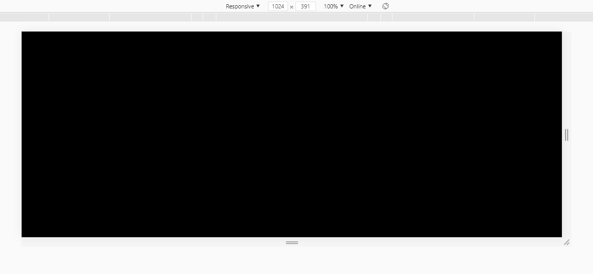
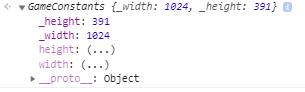
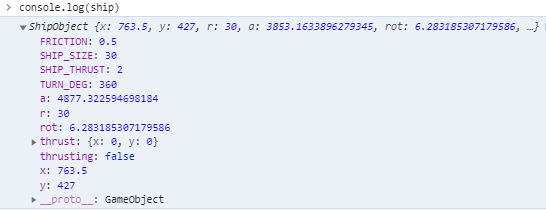
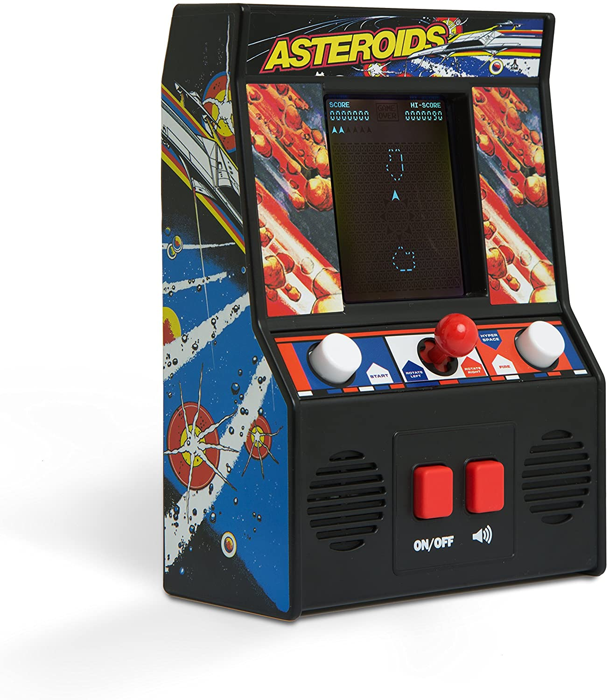
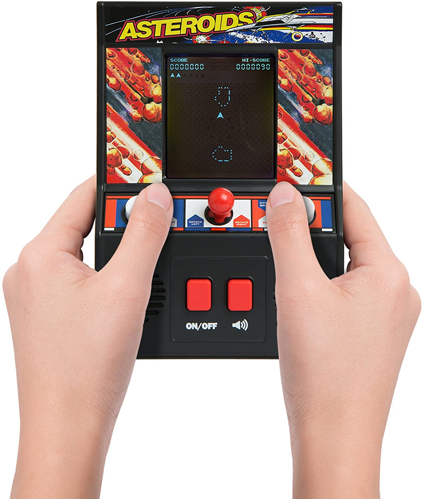

# An OOP guide to Creating an Asteroids Game using Vanilla JS
written by aFuzzyBear.

I had came across this youtube video on how to create a game that is a childhood favourite of mine. The legendary Asteroids from Atari.[^1] 
<a href="http://www.youtube.com/watch?feature=player_embedded&v=H9CSWMxJx84
" target="_blank"></a>
I figured why the hell not, I am getting a bit better at Javascript why not give this a shot. Credits to the instructor for making a thoroughly enjoyable code-along video tutorial of this game. 

What made this particular tutorial 'enjoyable' was that the instructor was using methods and techniques that I wasn't *taught* perse. So far I have been slowly learning JavaScript using [MDN Docs](https://developer.mozilla.org/en-US/docs/Learn) and other's but predominately I am a fellow of the school of MDN. 

As I was going along with the instructor I was find myself in a bit of an uncomfortable space. Without sounding overly critical, the instructor was using pre-ES6 standards in the script.

It wasn't written in 'strict mode' and had no Object Orientated Approach towards it. Plus I was only really half satisfied with the outcome, I was wanting more, and thus began  my climb up the proverbial 'Mount Improbable' 🗻. 

In a way this was what I have been learning whilst I have been meandering my way through the JavaScript Mountain Range. So I figured as a challenge to make a similar program to what was demonstrated in the video but bring it up to spec using what I have learnt to date. 


## Lets Begin
I wish to let you know, I have made this script extremely verbose by using JSDocs [^2]. This commenting style has a lot of benefits not only readability but also with use inside IDE's. I comment on everything, trying make my code as close to English as possible, apart from the math, which is just the nature of maths unfortunately.  

Lets begin by getting the boilerplate stuff out the way.

We are going to be needing a `asteroidGame.html` file and a `game.js` script file within the same directory.

`asteroidGame.html` should look like this:
```html
<!DOCTYPE html>
<html lang="en">
<head>
    <meta charset="UTF-8">
    <meta name="viewport" content="width=device-width, initial-scale=1.0">
    <title>Asteroids Game</title>
</head>
<style>
    *{
        margin:0;
        padding:0;
    }
    canvas{
        display: block;
        position: relative;
        width: 100%;
        height:100vh;
        overflow: hidden;
        overflow-y: hidden;
    }
</style>
<body>
    <canvas id="gameCanvas">
        <p>Huh, your browser doesn't seem to support HTML5! Sorry bud,</p>
    </canvas>
</body>
<script src="game.js"></script>
</html>
```
Quickly explaining what is going on here. We have a couple of basic style rules to allow the game to be applied to the full size of the viewport. 
Within the `<canvas>` element we have a fall-back tag in case the browser doesn't support the canvas element. 
Now load the html file through your local dev server and have it open. This was we can see the work that will be done in the JS being reflected in the browser. 

Now the boilerplate for the `game.js` is a lot easier. At the top of the file we will be adding the ['Strict Mode'](https://developer.mozilla.org/en-US/docs/Web/JavaScript/Reference/Strict_mode) command to the Global Environment, being at the top, this sets the rest of the script to adhere to following  ECMAScript  standards of writing JavaScript. To enable this we place the following : 
```javascript
'use strict'; //Placed on line 1
```


### Setup the Canvas

To set-up the canvas for the game, we first have to grab the canvas from the DOM. 

```js
const canvas = document.getElementById('gameCanvas');
```
Next we set-up the context for the canvas, stating that we will be using a 2-Dimensional context instead of a 3-Dimensional one like *webGl*
```js
const ctx = canvas.getContext('2d');
```


### Setting up the Animation Loop

Now lets get something on the screen. To do this we will be using the `window.requestAnimationFrame API`[^3] here the original tutorial had setup their own animation loop using `setInterval()` running at 30 fps which was creating a horrendous amount of *janking* motion when it was rendering. But by using the `window.requestAnimationFrame()` the performance of the script was notably improved but it forced my hand to having to do the tutorial in a completely different way.

```js
//place this at the bottom of the script
function gameAnimationLoop(){
    //Draw the Background -Space
    ctx.fillStyle = "black";
    ctx.fillRect(0,0,width,height);

    //Do other stuff here


    //Request animation frame
    requestAnimationFrame(gameAnimationLoop)

}
//Starting the Game Animation
gameAnimationLoop();
```

You should have a black screen that occupies the full viewport.

Next up we will be adding some functions that we will be needing throughout the script in various places so we will place those on the global scope.

## Functional Programming side of the Script

I like to keep the global variables and functions right at the top of the script. 
We will be rarely be changing them as we go. So its good to understand where to put the stuff that belongs in the global scope.

For the script we would be needing to reuse a lot of repetitive maths. Im calling this part the 'Functional side' simply because it's as **PURE** as it gets. 

The basic concept of Functional programming is that they take an input do something that will deliver the same output all the time. Keeping it pure means that once they are set their output is what we can depend on when we use them around the script.


#### Random Number Generator

Javascript has a built in 'random' number generator but its not really easy to work with. For starters the [`Math.random()`](https://developer.mozilla.org/en-US/docs/Web/JavaScript/model/Global_Objects/Math/random) returns a long tailed decimal point number between 0 and 1, now that is fine if you wanted a random decimal number. But it would require to be scaled according to use. 

So we would be making our own Random number Generator, that would return a whole number within a given range of numbers. 

```js
/**
 * @function RandomNumber Generator
 * @param {Number} min -Lowest Number in Range
 * @param {Number} max  - Highest Number in Range
 * @returns Random Number between the range of min - max
 */
function randomNumber(min,max){
    return Math.floor(Math.random()*Math.floor(max-min) + min)
}
```
Here we are creating the function that would return a random number between two arguments. This way we can generate a random number between a range of numbers, say 1-10 or 0-255 etc and it would give a random number when invoked. 


Another function that we would be creating is a Random Decimal Number Generator where we would be curtailing the number of decimals places to save some memory overhead and reap whatever marginal performance gains that come. We would be using this to preform a couple of different purposes but one is that its really handy to determine if something should be a positive integer or a negative value depending if the returned value is less than 0.5-this will be demonstrated later on in the script.


#### Random Decimal Number Generator
```js
/**
 * @function randomNumberDecimal Number
 * @returns Random Decimal number fixed to 4 decimal places. 
 */
function randomNumberDecimal(){
    return +Math.random().toPrecision(4)
}
```

Here we are ensuring that the return value is an integer(number) by using the ternary `+` symbol. You can try this in the console:
```js
let a = '10';
console.log(a) // ''10''
typeof(a) //"string"
let b = +a
console.log(b) // 10 
typeof(b) //"number"
```
Next  we fix the returned sum to four decimal places. Which is sufficiently long to be random and small enough that it wouldn't take up extra memory when computing. 

#### Convert to Radians

```js
/**
 * @function convertRadians
 * @param {Number} degrees in Decimal
 * @returns Degrees in Radians
 */
function convertRadians(degrees){
    return +(degrees / 180 * Math.PI)
}
```
Javascript likes radians, as it turns out. [^4]. This will save a lot of unnecessary complications when we start making the spaceship rotate clockwise and counter-clockwise. 

#### Working out the Distance between Objects

These two functions carry out a similar purpose to each other. The long and short of it is we will be working out the distance between two points using cartesian geometry.[^5]

```js

/**
 * @function distanceBetweenPoints
 * @description
 * Takes the  distance between two points A(x,y) and B(x,y) 
 * 
 * @param {Number} x1 - X - Co-ordinate of the Primary Object
 * @param {Number} y1 - Y - Co-ordinate of the Primary Object
 * @param {Number} x2 - X - Co-ordinate of the Secondary Object
 * @param {Number} y2 - Y - Co-ordinate of the Secondary Object
 * @returns Distance in Pixels
 * 
 */
function distanceBetweenPoints(x1, y1, x2, y2) {
    return Math.sqrt( (x2 - x1)** 2 + (y2 - y1)** 2)
}
```
The next function takes the same principles and apply it to circles [^6]. Here we are taking the distance between two points and subtracting it of the sum of the radius of the two circles, using the [`Math.ceil()`](https://developer.mozilla.org/en-US/docs/Web/JavaScript/Reference/Global_Objects/Math/ceil) to return the number rounded up to the nearest whole number. 

```js
/**
 * @function distanceBetweenCircles
 * @param {Number} x1 - X - Co-ordinate of the Primary Object
 * @param {Number} y1 - Y - Co-ordinate of the Primary Object
 * @param {Number} r2 - R - Co-ordinate of the radius of the Primary Object 
 * @param {Number} x2 - X - Co-ordinate of the Secondary Object
 * @param {Number} y2 - Y - Co-ordinate of the Secondary Object
 * @param {Number} r2 - R - Co-ordinate of the radius of the second Object 
 * @returns 
 * Returns the distance between two circles 
 */   
function distanceBetweenCircles(x1,y1,r1,x2,y2,r2){
    return Math.ceil (Math.sqrt( (x2 - x1)**2 + (y2-y1)**2) - (r2+r1) )
}
```

Now that is the Global Scope populated with the few functions that we will be needing through in the script. 

## Technical Considerations

Lets quickly discuss some of the technical considerations that I had to take in order to create what I thought the game would look like. 

In my head I wished for a game, a replica of the game that I played as kid. I wanted to remember that feeling of piloting a small spacecraft through the asteroid belt. Growing older does make the power of nostalgia stronger.  

For this game, I was wanting a start screen, a highscores screen, a game screen and a few other things in between. 

This leads us to undertake what is known as a Model-View-Controller design paradigm.[^7] The central tenants of this design pattern is that the model holds the components of the applications structures and patterns. 


The Game Model is the data-structures that we will be using that is independent of the user interface. It manages and directs the data based on predefined logic and methods set by the models. 

By this I mean that we would be using a model to hold reference to the game: its variables and methods. 

We would also have a model for the ship and asteroids as these are independent data structures that would be controlled by their respective models. 

The View is the visual representation of the data within the model. There can be multiple views supported from the main model, we will be using this to develop the game screens.

The controller which accepts the input from the user provides the interface to determine which game view would be used and manipulating the data sent to the model. 

This design pattern fits within the scope of what we are trying to accomplish. In order to really achieve this MVC design we would be using a Object Orientate Approach to our game. Without really going far into the script we have in effect took a massive technical tangent to the original script.

At this point the original script from the Youtube tutorial was running kind of parallel to the direction I was undertaking however the similarities between our two scripts started to feel foreign too each other. 

## Setting up the Game Models

In order to follow the MVC design pattern and to keep with a strictly Object Orientated Approach [^8] to making this Asteroids game, we need to create some parent models or classes for our objects.

The best way to approach this is by breaking up the objects that we will be having into common properties and what is exclusive to itself. 


 1) We need to keep an object that acts like a single point of truth for a lot of the game variables that we would be using repetitively throughout the script. There would also be methods(functions) that would be solely specific to the game and not related to either the spaceship or asteroids. If anything they should be able to access this model for reference at any time.
   [see class GameModel](#class-gamemodel).
 2) We need to have a shared object that would hold similar properties that would be between both the spaceship and the asteroids. From this we can then build out each object
   [see class BasicObject](#class-basicobject)
 3) Building a object literal or model for the spaceship and asteroids respectively. Each would have methods that would be relevant solely to them. Keeping the methods of these objects separate. 
   [see class ShipObject](#class-shipobject)
   [see class AsteroidObject](#class-asteroidobject)

### class GameModel
First up we are going to create a parent class for all the game constants and variables that we would be using. The original tutorial has these *cluttering* the global scope which made it awfully cumbersome. By moving these to an object we would be making it easier to reference and manage these variables in the game.

First up we would need to get the width and height of the canvas and have this automatically update every time the window is resized. This keeps the canvas elements inside the canvas respective of the viewport as it changes sizes. By getting this out early doors we can work with a more pixel sharp and responsive canvas. Which is to the benefit of the greater good. 

We would be using the `getter` accessor method [^9] if you are unfamiliar with it, this is a great introduction.
```js
class GameModel{
    constructor(){
        /**
        * @this this._width - Private width variable that would store the size of the window width
        */
        this._width = Number();
        /**
         * @this this._height - Private Height variable that would store the height of the window
         */
        this._height= Number();
        
        /**
         * Calls the getCanvasDimensions method
         */
        this.getCanvasDimensions();
        //Getting the Width and Height as soon as the Window loads
        window.addEventListener('load',()=>{
            this.getCanvasDimensions()
        })
        //As the window is resized we are getting the new Canvas Dimensions
        window.addEventListener('resize',()=>{
            this.getCanvasDimensions();
        })
       
    }
    /**
     * @method getCanvasDimensions
     * @description Obtains the Width and Height of the canvas respective to the viewport and the device's own pixel density. This is to provide accurate values for rendering the elements ont he canvas
     */
    getCanvasDimensions() {
        // Width is determined by the css value for the viewport width this is then respected by the device pixel ratio. This is then used to set the canvas.width value
        this._width = Math.round((Number(getComputedStyle(canvas).getPropertyValue('width').slice(0,-2))/devicePixelRatio) * devicePixelRatio);
        //Setting the canvas width 
        canvas.width = this._width
        
        // height is determined by the css value for the viewport height this is then respected by the device pixel ratio. This is then used to set the canvas.height value
        this._height = Math.round((Number(getComputedStyle(canvas).getPropertyValue('height').slice(0,-2))/devicePixelRatio) * devicePixelRatio);
        //Setting the canvas height
        canvas.height = this._height
        
    }
    
    /**
     * @this this.width - Returns the width of the canvas
     */
    get width(){
        //This sets the width to the private _width value
        return this._width
        
    }
      /**
     * @this this.height - Returns the height of the canvas
     */
    get height(){
        //This sets the height to the private _height value
        return this._height
    }

    }
}

```
There is a couple of things happening here that is worth commenting on. First we set internal `this` properties for the width and height. The purpose being is that these update as the window loads up, so it doesn't have a `null` value. We place a method call within the constructor function as we need to establish that the method call `getCanvasDimensions()` is invoked when it the object is created. Secondly we place event listeners again within the constructor to re-obtain the new width and height value as the window resizes. 

We then use the `get` accessor function which lets us *get the new value* when it is called. This is all done in the name of responsiveness. We will see exactly how it looks soon once we start drawing the spaceship.

Next we are going to be instantiating this new object literal to something that we can now model, and that is what we are calling it.
```js
let model = new GameModel()
```
</img>
This looks right, now go ahead and resize the window and `console.log(model.width)` and `console.log(model.height)` respectively. Notice how it presents the new sizes as the window changes. (This was a huge win for me, three canvas projects later and I finally fix this bug! 💪)

As we begin to develop the game out we will be adding to this Object Class with additional properties.

Since we are using `requestAnimationFrame()` API we need to understand something about it. It is a magical recursive loop, that doesn't break your computer. But as it does its looping it does so at an inconsistent rate, this is often client-machine dependant. So in a single second, the recursive loop will go over itself anywhere between 50-100 times in a second. Each time it does it re-draws or re-executes the animation function. Each *scene* or *frame* is a snapshot of the programs recalculations in time. 

To give a our animation Loop a form of consitistancy we set a property to indicate the number of frames to execute each second. This gives our animation a steady frame rate, of each frame being executed 1/60th of a second or 16.6ms. So that's one new frame every 16.6ms, which is easier for the calculations which we will be doing. 

So in the `class GameModel` constructor function we add the following along with the other  properties. 
```js
class GameModel{
    constructor(){
        ...
        /**@this this.FPS - Frames per Second */
        this.FPS = Number(60)
    }
}
```

### class BasicObject
This is a shared parent object literal class that would contain the most basic shared properties between the spaceship and the asteroids. This is straight forward:

```js
class BasicObject{
    /**
     * 
     * @param {Number} x - Position of Object on X - Axis 
     * @param {Number} y - Position of Object on Y - Axis
     * @param {Number} r - Radius of the Object
     * @param {Number} a - Angle of the Object (in deg)
     */
    constructor(x,y,r,a){
        /**
         * @this this.x -  Position of the Object on the X - Axis
         */
        this.x = Number(x);
        /**
         * @this this.y -  Position of the Object on the Y - Axis
         */
        this.y = Number(y);
        /**
         * @this this.r -  Radius of the Object
         */
        this.r = Number(r);
        /**
         * @this this.a - Angle of the Object - converted to Radians
         */
        this.a = convertRadians(a); //Converted to Radians

    }
}
```
Really this would save us repeating these properties as we create the spaceship and the asteroids. 

### class ShipObject
Right now lets do something fun.  For this class we will be building up over time. We will be adding new properties to it as we make the ship more complex. 

We will be looking to make the following spaceship.
    </img>.

To do this lets first extend the `BasicObject` class to start incorporating some of the properties that we need for building our spaceship.

```js
class ShipObject extends BasicObject{
     /**
     * @constructor
     * @param {Number} x - Position of Object on X - Axis 
     * @param {Number} y - Position of Object on Y - Axis
     * @param {Number} r - Radius of the Object
     * @param {Number} a - Angle of the Object (in deg)
     * @param {Number} rot - 360/deg of turning
     * @param {Boolean} thrusting - Flag- Registers if the ship is thrusting is active
     * @param {Object} thrust - Object contains the thrust vectors for the Ship
     */
    constructor(x,y,r,a,rot,thrusting,thrust){
        super(x,y,r,a)//Inheriting the Properties from the Parent Object
     
        /**
         * @this this.rot - Ship can only rotate around 360deg of a circle  converted to Radians
         */
        this.rot = convertRadians(rot);//Converted it into Radians
     
        /**
         * @this this.thrusting - Boolean Flag! True when the ship trust is active
         */
        this.thrusting = Boolean(thrusting);
     
        /** 
         * @this this.thrust - Provides an object of vectors for the ship when travelling
        */
        this.thrust = {...thrust};
     
        /**
         * @this this.SHIP_SIZE 
         * Height of the Ship in px's - Same as the Radius
         */
        this.SHIP_SIZE = Number(r);
     
        /**
         * @this this.Friction 
         * Adds a Friction co-efficient to the movement of the ship:Friction in Space (0 = no friction, 1 = 100% friction)
         */
        this.FRICTION = Number(0.5); 
        
        /**
         * @this this.SHIP_THRUST 
         * Acceleration of the Ship, in px/sec^2
         */
        this.SHIP_THRUST = Number(2); // acceleration of the Ship, px/sec^2
     
        /**
         * @this this.TURN_DEG
         * This is the turning angle in deg/sec. 
         */
        this.TURN_DEG = Number(360); // Turns in deg/sec


    }
    //Methods Go Here
}
```
Quick note: I have kept the **constants** that the ship would be using like typed in Upper-case, which is just to make it easier to know what is a variable and a constant. 
```js
this.SHIP_SIZE
this.FRICTION
this.SHIP_THRUST
this.TURN_DEG
```


To instantiate the object we will be calling it using:

```js
//On the Global scope for the time being
let spaceship = new ShipObject(
    model.width /2,
    model.height/2,
    30,
    90,
    360,
    false,
    {x:0,y:0}
);
```
This should produce the following when `console.log(ship)` (x & y values will be somewhat different)-(it was originally called `ship`🚢, this got changed to `spaceship`🚀) 
</img>
<!-- TODO-Get a new snapshot of the spacehship console.log -->
Awesome, we have gotten our spaceship object made up with little to no complications what-so-ever. 😑 

#### Draw method
Now lets get the spaceship on the screen. First we would want to create a draw method on the ShipObject's prototype chain. 
```js
class ShipObject{
    //methods
    draw(){
       //ctx styles
       ctx.strokeStyle = 'white'
       ctx.lineWidth = 2;
       //The outer Triangle
       ctx.beginPath();
       ctx.moveTo(
           //Nose of the spaceship

            this.x + 4 / 3 * this.r * Math.cos(this.a),
            this.y - 4 / 3 * this.r * Math.sin(this.a)
        );
        ctx.lineTo( // rear left
            this.x - this.r * (2 / 3 * Math.cos(this.a) + Math.sin(this.a)),
            this.y + this.r * (2 / 3 * Math.sin(this.a) - Math.cos(this.a))
        );
        ctx.lineTo( // rear right
            this.x - this.r * (2 / 3 * Math.cos(this.a) - Math.sin(this.a)),
            this.y + this.r * (2 / 3 * Math.sin(this.a) + Math.cos(this.a))
        );
    
        ctx.closePath();//Finishes of the Outer Triangle
        ctx.stroke();

        //Drawing the Cockpit
        ctx.beginPath();
        ctx.fillStyle = 'red';
        ctx.lineWidth = 2;
        ctx.moveTo( // top of the cockpit
            this.x - (1 / 5 * this.r - this.SHIP_SIZE) * Math.cos(this.a),
            this.y + (1 / 5 * this.r - this.SHIP_SIZE) * Math.sin(this.a)
        );
        ctx.lineTo( // rear left of the cockpit
            this.x - this.r * (1 / 3 * Math.cos(this.a) +  0.5 * Math.sin(this.a)),
            this.y + this.r * (1 / 3 * Math.sin(this.a) - 0.5 * Math.cos(this.a))
        );
        ctx.lineTo( // rear right of the cockpit
            this.x - this.r * (1 / 3 * Math.cos(this.a) -  0.5 * Math.sin(this.a)),
            this.y + this.r * (1 / 3 * Math.sin(this.a) + 0.5 * Math.cos(this.a))
        );
        ctx.fill();//Fill in the Shape
        ctx.closePath();//Finishes of the Triangle
        ctx.stroke();
        //More to be added....
    }

```
Now to have the ship drawn on the screen we would invoke this method within the [gameAnimationLoop](#setting-up-the-animation-loop) Loop. 

Here we are instructing the `ctx` render engine to render three white lines for the outer triangle of the spaceship. `ctx.moveTo(x,y)` takes the x and Y locations of the spaceship and then takes a position a third of itself above its location as the nose or the tip of the ship, from here we create a `ctx.lineTo(x,y)` which then instructs it to draw a line to the rear left, then a line to the rear right. This is then closed off by the `ctx.closePath()`. With the inner cockpit we are reducing the size of the triangle and positioning it within the center of the ship. We are also instructing it to be filled in a `red` colour. 

```js
//Game Animation Loop
function gameAnimationLoop(){
    ctx.fillStyle = 'black'
    ctx.fillRect(0,0,model.width,model.height);
    //Drawing the 🚀
    spaceship.draw();


    //Request animation frame
    window.requestAnimationFrame(gameAnimationLoop)
}
gameAnimationLoop()
```
You should have an object now appear on the canvas that should look very similar to this image of the spaceship.
</img>
👍

#### Making the ship move
Now we want to make the ship move about. If you noticed we created a `thrusting` flag, which just records if the ship's thrust is On or Off. We can use these flags to determine when to switch a feature on and off. in this case we would using it to instruct the model to update when the ship the thrust is active, which would be seen as:

We would also need to rotate the ship clockwise and counter-clockwise. This would be controlled by keyboard inputs which we would make up second.
</img>

</img>
But first lets make the functionality for the spaceship to fly around space.
Back in the `draw()` method we will add this block of code:

```js
class ShipObject{
    //methods
    draw(){
        ... 
        if(this.thrusting){
            //Add Thrust vector 
            this.thrust.x += this.SHIP_THRUST * Math.cos(this.a) / model.FPS **1/2;
            this.thrust.y -= this.SHIP_THRUST * Math.sin(this.a) / model.FPS **1/2 ;
            //Draw thrust animation
            ctx.beginPath();
            ctx.strokeStyle = "yellow";
            ctx.fillStyle = "red"
            ctx.lineWidth = 2;
            ctx.moveTo( // rear center behind the spaceship
                this.x - 4 / 3 * this.r * Math.cos(this.a),
                this.y + 4 / 3 * this.r * Math.sin(this.a)
            );
            ctx.lineTo( // rear left
                this.x - this.r * (2 / 3 * Math.cos(this.a) +  0.75 * Math.sin(this.a)),
                this.y + this.r * (2 / 3 * Math.sin(this.a) - 0.75 * Math.cos(this.a))
            );
            ctx.lineTo( // rear right
                this.x - this.r * (2 / 3 * Math.cos(this.a) -  0.75 * Math.sin(this.a)),
                this.y + this.r * (2 / 3 * Math.sin(this.a) + 0.75 * Math.cos(this.a))
            );
            ctx.fill();//Fill in the Shape
            ctx.closePath();//Finishes of the Triangle
            ctx.stroke();
        }
        
        //Applying Friction to slow down the spaceship when Not thrusting
        if(!this.thrusting){
            this.thrust.x -= this.FRICTION * this.thrust.x /model.FPS
            this.thrust.y -= this.FRICTION * this.thrust.y /model.FPS
            
        }

        //Rotate spaceship
        this.a += this.rot

        //Move the spaceship
        this.x += this.thrust.x;
        this.y += this.thrust.y;

        //Handle screen edges
```
Now lets get the event listeners setup. For the present we will be applying this logic currently to the `GameModel` In the `GameModel` literal we will create two methods, one to handle the key-down press event and one as we release the key or the key-up press event. As we press down we will active the thrust and rotate the ship, and as we release we want to stop the thruster and rotation, else they would just continue to be on.

```js
class GameModel{
    //methods
    keyDown(event){
            
        if(event.key === 'ArrowUp' || event.key === 'w'){
            //Start Thrusting
            spaceship.thrusting = true
        }
        if(event.key === 'ArrowRight' || event.key === 'd' ){
        //Rotate Right
        spaceship.rot = -convertRadians(spaceship.TURN_DEG) / model.FPS
        }
        if(event.key === 'ArrowLeft' || event.key === 'a' ){
        //Rotate Left
        spaceship.rot = convertRadians(spaceship.TURN_DEG) / model.FPS
        
        }
        
    }
    keyUp(event){
        if(event.key === 'ArrowUp' || event.key === 'w'){
            //Stop Thrusting
            spaceship.thrusting = false
        }
        if(event.key === 'ArrowRight' || event.key === 'd' ){
            //Stop Rotating
            spaceship.rot = 0;
        }
        if(event.key === 'ArrowLeft' || event.key === 'a' ){
            //Stop Rotating
            spaceship.rot = 0;
        }
    }

```
To add these event listeners we do so just above the `gameAnimationLoop` loop at the bottom of the script. 

```js
document.addEventListener('keydown',model.keyDown)
document.addEventListener('keyup',model.keyUp)
```
Now you should have your spaceship moving and zooming about that screen 😊.

#### Handle screen edges
But we have a problem as the ship moves off the screen it doesn't appear on the opposite side of where it exited. This is a problem that can be fixed by adding a method on the `GameModel` Object that would handle for screen edges.

```js
class GameModel{
    //methods
    screenEdges(obj){
        if(obj.x < 0 - obj.r){
            obj.x = this.width + obj.r
        }
        else if(obj.x > this.width + obj.r){
            obj.x = 0 - obj.r
        }
        if(obj.y < 0 - obj.r){
            obj.y = this.height + obj.r
        }
        else if(obj.y > this.height + obj.r){
            obj.y = 0 - obj.r
        }
    }  
```
Here we will be passing in different objects like the spaceship and asteroids and as such we will be calling on this function a lot. All we are doing is taking in the x and y position of the object and reversing them depending on what side they exit.

Back in the `draw()` method we have setup we will apply this statement at the bottom

```js
        //Handle screen edges
        model.screenEdges(this)

```
Now you the spaceship should reappear on the opposite side of where it entered. Now we are flying 🚀.

The spaceship object is pretty complete for now, we will come back and add other functionality like; lasers and collision detection etc.

### class AsteroidObject

Now to the namesake of the game.  Firstly we need to create an asteroid field, where each asteroid would randomly appear on the screen and have their own respective vectors which lets them follow a path across each frame. They also should be able to collide with each other and ricochet of each other. We would also need to be able to destroy them completely and replace them with smaller fragments. 

But before we do anything that remotely complicated, we need to create our Asteroid Object literal. This model will describe the properties that we would be using for each asteroid. 

```js
class AsteroidObject extends BasicObject {
    constructor(x,y,r,asteroidIndex){
        super(x,y,r)
        /**@this this.a - returns a random angle in radians */
        this.a = Math.random() * Math.PI * 2
        
        /**@this this.vX - random Velocity on the x-axis  */
        this.vX =randomNumber(15,30)/model.FPS * (randomNumberDecimal() <0.5 ? 1 : -1)
        
        /**@this this.vY - random Velocity on the y-axis  */
        this.vY = randomNumber(15,30)/model.FPS * (randomNumberDecimal() <0.5 ? 1 : -1)
        
        /**@this this.vertices - Random number of vertices for the polygon to be generated */
        
        this.vertices =Math.floor(randomNumber(2,8) + randomNumber(2,8)),//Each asteroid has a random number of vertices
        
        /**@this this.jaggedness - random determination on the amount of jaggedness on the asteroid */
        this.jaggedness = randomNumberDecimal(), // 0 = none 1 = 100
        
        /**@this this.offsets - Array of positions for the dimensions of the polygon */
        this.offsets = []
        
        /**@this this.asteroidIndex - Asteroid Index position in the Array */
        this.asteroidIndex = Number(asteroidIndex);
    }
}
```

Here we are going to be setting the asteroid x,y and radius separately, this way we can give them random values at run-time. We will come back to this. Next we are setting the `vX` & `vY` using a random number that would depending on the logic condition would either appear to be a positive integer or a negative integer travelling left to right or vice-versa. You may notice that I have an `astroIndex` which doesn't get used anywhere in the script. I  had introduced this to help with a few debugging issues where I had to label each asteroid to study their behaviour for a time. You can choose to ignore this entirely, but please be cautious of the changes made as you proceed.

Because we are wanting a variety of different asteroids where some are going to be jaggy and sharp and others to be smoother random polygons we need to have a few extra variables to hold such patterns.

#### Creating Asteroid Field
Now lets create an asteroid field. Since this is a feature of the game, we would be placing this next method on the `GameModel` prototype chain. 

```js
class GameModel{
    //Methods
    createAsteroidField(numberOfAsteroids){
        
        //clear the existing array
        this.asteroidField = new Array();
        //creating place holders
        let x,y,r,i

        for(let index = 0; index< numberOfAsteroids; index++){
            x = randomNumber(0,this.width)
            y = randomNumber(0,this.height)
            r = randomNumber(60, 100);
            //Giving the asteroid a Label - Done purely for debugging purposes
            i = index

            //Creating a buffer zone around the ship to prevent the asteroids randomly spawning on the ship
    
            if(distanceBetweenPoints(spaceship.x,spaceship.y,x,y) <= spaceship.r * 5 + spaceship.r){
                x = randomNumber(0,this.width) + (spaceship.x + spaceship.r + 20);
                y = randomNumber(0,this.height) + (spaceship.y + spaceship.r + 20);
            }
            this.asteroidField.push(this.createNewAsteroid(x,y,r,i))
        }
        return this.asteroidField
    }

    createNewAsteroid(x,y,r,asteroidIndex){
        let asteroid = new AsteroidObject(x,y,r,asteroidIndex);
        //Setting the values for the asteroids jaggedness
        for(let offset = 0; offset < asteroid.vertices; offset++ ){
            asteroid.offsets.push(
               Math.random() * asteroid.jaggedness * 2 + 1 - asteroid.jaggedness
            )
        }
        return asteroid
    }
}
```
These method will create a number of asteroids from a parameter which we can change throughout the script.  This will come in handy when we want to create more asteroids. 
We are also creating a buffer zone around the ship where if the asteroid spawns near a radial distance to the ship, it would be relocated to somewhere else in space and kept a distance away. 
We then push each newly created asteroid object to the `asteroidField` which is an array of asteroid objects.
To call this method we place it for the time being on the global scope.
```js
//placed ideally just above the Animation Loop
model.createAsteroidField(5)
```
#### Draw Method

The asteroids themselves each has their own draw method. This method is on the `AsteroidObject` prototype chain. Here we are instructing it to draw a polygon based on the values in the `asteroid.offset` array. This gives each asteroid their own unique shape. Reminiscent of the uniqueness of snowflakes. 

```js
class AsteroidObject{
    //methods
    draw(){
            //Draw Asteroids
            ctx.strokeStyle = '#BADA55';
            ctx.lineWidth = 2;
            ctx.fillStyle = 'transparent';
            //draw a path
            ctx.beginPath();
                ctx.moveTo(
            this.x + (this.offsets[0]  * this.r) * Math.cos(this.a),
            this.y + (this.offsets[0]  * this.r) * Math.sin(this.a)
            )
            //draw the polygon and jaggedness for each asteroid
            for(let polygon = 1; polygon < this.vertices; polygon++){
                ctx.lineTo(
                    this.x + (this.offsets[polygon] * this.r) *  Math.cos(this.a + polygon * Math.PI * 2 / this.vertices),
                    this.y + (this.offsets[polygon] * this.r)*  Math.sin(this.a + polygon * Math.PI * 2 / this.vertices)
                    )
                }
            ctx.fill();
            ctx.closePath();
            ctx.stroke();

            //handle collision detection
            
            //move asteroid
            this.x += this.vX
            this.y += this.vY
            
            
            //handle edge of screen
            model.screenEdges(this)
    }

```

To call this function in the Animation Loop we will add the following `Array.forEach()` loop.

```js
//Global Scope-At the Bottom of the Script
function gameAnimationLoop(){
    ctx.fillStyle = 'black'
    ctx.fillRect(0,0,model.width,model.height);

    spaceship.draw();

    //Drawing each asteroid on the screen
    model.asteroidField.forEach((asteroid)=>{
        asteroid.draw()
    })


    //Request animation frame
    window.requestAnimationFrame(gameAnimationLoop)
}

```
Now you should have a set of randomly assorted asteroids, all floating about the screen 😍


Now we can start building a game.

## Building out the Game

Here we are going to be adding more functionality to the game, these are things that I thought: 'that would be cool to have.' 

And so this project has naturally grown arms and legs of its own. 

The things we would be adding to this would be:
1) collision detection between:

   - ship and asteroid: where the ship is blown up. We would have an exploding animation. It should decrease the game lives counter by one. 
    -asteroid and asteroid: where each asteroid if it collides with another it should ricochet off each other and go in different directions. 
2) Lasers 
    - shooting and blowing up each asteroid into smaller pieces. Keeping a score as each asteroid is breaking up. If the pieces break into smaller fragments, once they reach a certain size they disappear. 
  
3) Keep a score and a Lives counter. Game ends when the player runs out of lives. Levels increase if the player is still alive and their is no more asteroids left.

(Ill add more here as we go, something about it growing arms and legs)


### Collision Detection

Remember the [`distanceBetweenPoints()`](#working-out-the-distance-between-objects) and [`distanceBetweenCircles()`](#working-out-the-distance-between-objects) that we created in the global space. This is where we would start to utilize these functions.

#### Asteroid
To see if a collision has happened we are checking if the distance between two asteroids is less than the radius of the asteroid about to collide. If it does we will change the vector values for both the asteroids in question. 
In the `AsteroidObject` methods chain we will add this code block that pretty much does that with little *Jank*.
```js
class AsteroidObject{
    //methods
    asteroid2asteroidCollision(){
        let currentAsteroid = this;
        model.asteroidField.forEach((otherAsteroid)=>{
            if(currentAsteroid != otherAsteroid){
                if(distanceBetweenCircles(currentAsteroid.x,currentAsteroid.y,currentAsteroid.r,otherAsteroid.x,otherAsteroid.y,otherAsteroid.r) < currentAsteroid.r + currentAsteroid.x ){
                    //Make the asteroids 'softly' ricochet off each other
                    //There has been many different attempts at getting this right, this is by far the best attempt at getting the asteroids to move off and change direction and their velocity that produces the least amount of Janking
                        
                        currentAsteroid.vX = currentAsteroid.vX/( (model.FPS / 2))  + Math.sin(-currentAsteroid.a) 
                        otherAsteroid.vX = otherAsteroid.vX/ (model.FPS / 2)  + Math.sin(-otherAsteroid.a) 

                        currentAsteroid.vY = currentAsteroid.vY/ (model.FPS / 2)  + Math.cos(-currentAsteroid.a)  
                        otherAsteroid.vY = otherAsteroid.vY/ (model.FPS / 2)  + Math.cos(-otherAsteroid.a)
                    //This was easy...😑

                }
            }
        })
    }
```
We are using the `forEach()` array iterator to check if the asteroid that is currently being drawn in that frame is not the same as every other asteroid.
We then check if the distance between the asteroids is less than the asteroid radius that is colliding with it , meaning that they are overlapping at the radial point of each asteroid. We are then changing the velocity of both asteroids respective of the framerate and their angles.

To instantiate this method every time the asteroid is drawn we place it within the `AsteroidObject.draw()` method. 

```js
class AsteroidObject{
    //methods
    draw(){
        ... 
        ctx.stroke();
       
       //Handle collision Detection
        this.asteroid2asteroidCollision()
        this.asteroid2shipCollision()    

        //move asteroid
        this.x += this.vX
        this.y += this.vY
        
        //handle edge of screen
        model.screenEdges(this)
    }
```
To really test this new method it would be good to increase the number of asteroids in the asteroid field to something like 15 just to fill up the screen, in all honesty you can play with this value as much as you wish
`model.createAsteroidField(15)`


#### Ship
To detect if the Ship has collided with an asteroid we will need to register a `spaceship.exploding` flag as true. For if the ship is exploding we would want to draw an explosion animation. Then reset the ship's position to the center of the screen. (and reduce the lives's count by one...)

To detect the asteroid 2 ship collision we would apply this method to the `AsteroidObject` chain. 
```js
class AsteroidObject{
    ...
    //methods
    asteroid2shipCollision(){
        if(distanceBetweenPoints(this.x,this.y,spaceship.x,spaceship.y) < spaceship.r + this.r && !spaceship.immune){
            // register that the ship is exploding 
            model.shipExploding = true
        }

    }
}
```
There is a few extra properties that had to be set to set this up. First in the `GameModel` Object literal we put this flag in.
```js
class GameModel{
    constructor(){
        ...
        /**@this this.shipExploding - Registers a flag if the ship is exploding */
        this.shipExploding = false
```

```js
class ShipObject{
    //constructor
    constructor(...){
        /**@this this.immune - Immunity from Explosions Flag */
        this.immune = Boolean(false)
    }
    //methods 
    explodeShip(){
        //Prevent the ship from moving
       if(!this.immune){ 
           this.thrust = {
            x:0,
            y:0
        }}

        //Drawing the Explosion
        ctx.beginPath();
        //Outermost circle - Dark Orange
        ctx.strokeStyle = '#db4200';
        ctx.fillStyle='#db4200'
        ctx.arc(this.x,this.y, this.r +10, 0, Math.PI * 2, false);
        ctx.fill()
        ctx.stroke();
        // n-2 circle - Orange
        ctx.beginPath();
        ctx.strokeStyle = '#f26900';
        ctx.fillStyle='#f26900'
        ctx.arc(this.x,this.y, this.r + 5, 0, Math.PI * 2, false);
        ctx.fill();
        ctx.stroke()
        // n-1 circle - Yellow
        ctx.beginPath();
        ctx.strokeStyle = '#f29d00';
        ctx.fillStyle='#f29d00'
        ctx.arc(this.x,this.y, this.r + 2, 0, Math.PI * 2, false);
        ctx.fill();
        ctx.stroke();
        
    }

}
```
This is the exploding animation function. We are basically instructing the `ctx` render engine to create three concentric circles to give the appearance of an explosion. Now we are going to set this to be active if the ship is registered as being *exploding* 
Once it explodes after a certain time limit we want it to re-spawn at the center of the screen. 

(Also I would ideally like it to decrease a live but that is still proving tricky, mind you something could be said about the power of procrastination, if it wasn't for this singular issue, other problems wouldn't of managed to of been resolved, like the janking collisions between asteroids I mean it was ugly for a while. And the resizing the screen, I cant tell you how chuffed I am still at this. So I still hold out hope yet, that by the time we get to that, I've of figured it out by then 🙊...The climb to the summit is indeed a perilous one. )

Once the spaceship explodes we want to give it some sort of immunity from being destroyed for a period of time to let the user get somewhere safe before they are susceptible to being destroyed by an asteroid. 

So lets add a change to the spaceship, If it is immune it turns golden >? 
```js
class ShipObject{
    //methods
    draw(){
        //At the top
        if(this.immune){
                ctx.strokeStyle = "gold";
                ctx.fillStyle = "gold"
        }else{
            ctx.strokeStyle = "white";
            ctx.fillStyle = "red"
        }
        //Delete line 390
        ...
        //Drawing the Cockpit
            ctx.beginPath();
            // ctx.fillStyle = 'red';<---Delete this line
    }
```
This method is placed on the `GameModel` methods chain,
```js
class GameModel{
    //methods
    createNewSpaceShip(){
        if(spaceship){
            //Delete the existing spaceship 🚀💀
            spaceship = null;
            
        }
        //Instantiating a new spaceship 🎆🚀
        let newSpaceship = new ShipObject(
            model.width /2,
            model.height/2,
            30,
            90,
            360,
            false,
            {x:0,y:0}
        )
         //Making the New Ship immune to Being Exploded
         newSpaceship.immune = true
         //Switch off the Exploding Flag
         model.shipExploding = false
        //This just makes sure we can move afterwards
         newSpaceship.thrusting =false
         return spaceship = newSpaceship;
    }
}
```
Okay everything should be set now to make it work. In the animation loop we write the following

```js
function gameAnimationLoop(){
    ...

    if(!model.shipExploding) {
            spaceship.draw()  
        }else{
            spaceship.explodeShip();
            //Timeout's to carry out these functions after a certain period of time.        
            setTimeout(model.createNewSpaceShip,1000)
            setTimeout(()=>{
            //Removing the ships immunity after 5 sec
                spaceship.immune = false
            },5000)

    } 
```
Using `setTimeout()` macro-promise we can do some time-delayed actions like, setting the explosion to last for 1 second, and then create a new spaceship. Once that promise is carried out we then look to remove the immunity from the ship after a period of 5 seconds... 

Hopefully all those flags we set work and you should have something that goes like this:
<figure>
  <video controls="true" allowfullscreen="true"  width="500" height = "300">
    <source src="./assets/video/asteroidswhatitshouldlooklikesofar.mp4" type="video/mp4">
        <p>Sorry but the video doesn't seem to be working...Ill have it loaded up somewhere and hopefully working at some point.</p>
    </video>
</figure>

### Lasers - shooting and blowing things up

We discussed when building out the game, what we would like from it. As awesome as it is, flying the spaceship across the screen and watching all that hard work come together. Lets make it do what the original game was famed at doing and that was blowing up asteroids into even smaller asteroids and racking up high scores. 

#### Shooting the Lasers
Lets begin by making the lasers. First lets add some properties to the `ShipObject` These will be for storing the lasers as objects as they are fired in an array. A flag is used to register the firing of lasers, and a distance they will travel that is respective of the screen width.
```js
class ShipObject{
    constructor(...){
        //Add these properties:
       /**@this this.laserStatus - Flag - Registers if the laser is actively shooting ON or OFF  */
        this.laserStatus = Boolean(true);
        /**@this this.laserArray - Array Element that would store each laser object as they are fired */
        this.laserArray = Array();
        /**@this this.laserDistance - Distance the Laser would travel in respects to the screen width; 0 < laserDistance < 1(width) */
        this.laserDistance = 0.5  
    }
}
```
Next we are going to create a `drawLaser()` method on the `ShipObject` chain.
```js
class ShipObject{
    ...
    drawLaser(){
        //Applying the lasers
        //Looping backwards through the laser array
        for(let laserIndex = this.laserArray.length-1 ; laserIndex >= 0; laserIndex-- ){
            //Calculate the distance travelled
            this.laserArray[laserIndex].distanceTravelled += 
                Math.sqrt(this.laserArray[laserIndex].vX**2 + this.laserArray[laserIndex].vY**2);

            if(this.laserArray[laserIndex].distanceTravelled > 
                    this.laserDistance * model.width)
                    {
                        this.laserArray.splice(laserIndex,1)
                     }
        }
        this.laserArray.forEach(laser => {
            //Draw each laser

            ctx.fillStyle = "red"
            ctx.beginPath();
            ctx.arc(laser.x,laser.y,this.SHIP_SIZE/8,0,Math.PI*2,false);
            ctx.fill();
            ctx.closePath();
            //move the laser
            laser.x += laser.vX
            laser.y += laser.vY

            //Handling the edge of screen adjustments for the laser
            //Slightly different to the screenEdges method
            
            if(laser.x < 0){
                laser.x = model.width
            }else if(laser.x > model.width){
                laser.x = 0
            }
            if(laser.y < 0){
                laser.y = model.height
            }else if(laser.y > model.height){
                laser.y = 0
            }
           
        })
        //Asteroid 2 Laser Collision Detection

    }
}
```

That is the method to draw the lasers, a few things to note in here, Firstly we are looping backwards through the array. [^10]. This is so the last laser that is fired appears last and the other lasers that are fired are moving in sequence to the order in which they were fired. This loop allows us to efficiently work out the distance that each laser travels and allows us to remove them after finding out the distance that the laser objects in the array is less than half of the screen width. If they exceed the distance then we remove them from the array. 

By doing this backwards for loop we can make sure the lasers are being drawn in the order that they are fired. 

To draw them, we would instruct it to do so in the `ShipObject.draw()` method.
```js
class ShipObject{
    ...
    draw(){
        ...
        //Laser 
        this.drawLasers()

        //Rotate spaceship
        ...
    }
}
```
So far so good, now we need to come up with a method that would let us fire off the lasers, basically every time the space-bar is hit it would create a laserObject ( you could forgive me but we can effectively ignore creating this from it's own Class Object-reason being that this object only contains properties that we are setting at run-time, there is nothing extra special about them, for they contain no methods or inheritance from another object). 
This laser object would be pushed to the laser array, where it would be removed after it has either travelled a certain distance proportionate to the half the width of the viewport.
```js
class ShipObject{
    ...
    shootLasers(){
        /**@var LASER_SPEED - Speed of the Laser in px/sec*/
        const LASER_SPEED = 500 
        /**@var LASER_MAX - Maximum number of laser objects that can be created */
        const LASER_MAX = 100 
        //create the laser object if it meets these conditions
        if(this.laserStatus && this.laserArray.length < LASER_MAX){
            this.laserArray.push({
                //Creating a laser object 
                //Shooting from the nose of the ship;
                x:this.x + 4 / 3 * this.r * Math.cos(this.a),
                y:this.y - 4 / 3 * this.r * Math.sin(this.a),
                //Applying the velocity
                vX: LASER_SPEED * Math.cos(this.a) / model.FPS,
                vY: -LASER_SPEED * Math.sin(this.a) / model.FPS,
                distanceTravelled:0//Tracks the distance of the laser travelling
            })
           
        }
        //Last laser in the Array
        if(this.laserArray.length >= LASER_MAX){
            this.laserArray.push({
                //Fire one last laser object 
                x:this.x + 4 / 3 * this.r * Math.cos(this.a),
                y:this.y - 4 / 3 * this.r * Math.sin(this.a),
                vX: LASER_SPEED * Math.cos(this.a) / model.FPS,
                vY: -LASER_SPEED * Math.sin(this.a) / model.FPS,
                distanceTravelled:0
            })
            //Resetting the array 
            this.laserArray = []
        }
    }
}
```
Lastly we are registering this to be activated once the space-bar event is occurring. In the `GameModel.keyDown(event)` method we will add this:
```js
class ShipObject{
    ...
    keyDown(event){
        ...
        if(event.key === ' ' || event.key === 'Spacebar' ){
            //shoot laser
            spaceship.shootLasers();
        }
    }
}
```

Now you should have a spaceship that can fly about space, in between asteroids that if they touch the ship it will do a small explosion and then re-spawn in the center of the screen. We then confer it some immunity and now we can fire small red balls as lasers towards these asteroids.

So far, still good?....

Next we will want our lasers to interact with the asteroids, destroying them and breaking  up the asteroid into smaller components.


#### Blowing up the Asteroids

We place the following loops to the `shootLasers()` method to detect if a laser has indeed 'collided' with the circumference of of each asteroid. It is a lot more difficult to place int eh lines of the polygon as the bounds for the detection, It would of required a really expensive loop that would of hindered the playability of the game. 

```js
class ShipObject{
    ...
    shootLasers(){
        ...
       //Asteroid 2 Laser Collision Detection
        model.asteroidField.forEach((asteroid,asteroidIndex)=>{

            this.laserArray.forEach((laser,laserIndex)=>{
                
                if(distanceBetweenPoints(laser.x,laser.y,asteroid.x,asteroid.y) < (Math.PI/2) * asteroid.r){
                
                    //destroy asteroid
                    model.destroyAsteroid(asteroidIndex)
                    //remove the laser
                    this.laserArray.splice(laserIndex,1)
                }
            })
        })
    }
}
```
Here we are using two `forEach()` loops nested within each other. This is so we can check the each asteroid in the field whether they are interacting with any of the lasers objects in the laser array. 

Note that we have a method on the `model` chain called `destroyAsteroid(astroIndex)` this method is setup to break up the asteroids into smaller parts if the laser hits the center of the asteroid. It would break up into smaller parts until they reach a minimum size after which they would be removed from the asteroid Field. 
We also are instructing the laser to be removed from the array when it interacts with the asteroid, by using the [`Array.splice()`](https://developer.mozilla.org/en/docs/Web/JavaScript/Reference/Global_Objects/Array/splice) method.


```js
class GameModel{
    //methods
    destroyAsteroid(index){
        // let asteroidCopy = asteroidsArray[index]
        let x = this.asteroidField[index].x;
        let y = this.asteroidField[index].y;
        let r = this.asteroidField[index].r;
    
        //split the larger asteroid into two when shot at
       if( r >50 && r <= 100 ){
           //Adding the size of the asteroid as the value to be added to the score
           this.currentScore += 20
           //Remove the asteroid that is shot at
           this.asteroidField.splice(index,1)
           //Create the smaller asteroid debris 
           this.asteroidField.push(this.createNewAsteroid(x,y,r/2,index + 1))
           this.asteroidField.push(this.createNewAsteroid(x,y,r/2,index + 2))
        }
        if( r >25  && r <50){
            //Adding the size as the asteroid as the value to be added to the score
            this.currentScore += 50
            //Remove the asteroid that is shot at
            this.asteroidField.splice(index,1)
            //Create the smaller asteroid debris 
            this.asteroidField.push(this.createNewAsteroid(x,y,r/2,index + 1))
            this.asteroidField.push(this.createNewAsteroid(x,y,r/2,index + 2))
            
       }
       if( r <= 25){
           //Adding the size as the asteroid as the value to be added to the score
           this.currentScore += 100
           //Remove the smallest asteroid 
           this.asteroidField.splice(index,1)
       }
       
    }
}
```
For this Method we are passing the Asteroid Index that we are taking from the `forEach()` loop in the `shootLasers()` method. This allows us to then take some values and store that on the block scope for the function. We then are checking the radius of the asteroids, if they fall within a certain range of size we allocate the proportionate weight for their score. 

Note that we are now keeping track of a score, this property is something we should add to the class constructor:
```js
class ShipObject{
    constructor(...){
        /**@this this.currentScore - Keeps track of the score */
        this.currentScore = Math.round(Number(0))
    }
}
```
And that should be that for shooting the lasers and making them blow up the asteroids into smaller pieces until they disappear.

We have made some excellent progress. We have managed to create the basics of the game engine, with user controls for the spaceship, firing lasers at uniquely self-generated asteroids, blowing them up into smaller pieces. Having the spaceship exploding and re-spawning with some conferred immunity in the center of the screen. Like I said, we have successfully made the game engine. Time to get a coffee and enjoy the fine work that has been done so far.....🚀🎉

### My Hilary Step

(Disclaimer - this next bit is somewhat of topic )

I must confess, I have had a bit of a journey with this particular exercise. It began from watching and trying to follow along with the youtube video that is posted at the top of this post. I started to run into issues with the way it was created and the bugs and Janking that I was experiencing when I was following along with the video and the instructors script. Having only recently learned about Object Orientated Programming from [MDN learning Docs](https://developer.mozilla.org/en-US/docs/Learn/JavaScript/Objects)  and created a couple of games prior to this. I thought I might carry out the same exercise. 

In doing so, I have experienced a lot of technical complications upon rewriting this game to the aforementioned specification. With each technical challenge has had its own sense of reward after accomplishing them. But none more so than the problem that I have so far eluded to in this post. 

Let me demonstrate my conundrum.

To begin we would be adding the following to our `.html` document as place holders

```html
    <style>
    #score{
        position: absolute;
        left: 90%;
        color: ghostwhite;
        z-index: 1;
    }
    #lives{
        position: absolute;
        left: 80%;
        color: ghostwhite;
        z-index: 1;
    }
    </style>
    <body>
        <p id="score"></p>
        <p id="lives"></p>
        ...
    </body>
```
We would need to now get these elements from the DOM and add some properties to the `GameModel` Object.
```js
    /** In the Global scope we are getting the Lives and Score elements from the DOM* - right at the top of the script/
    
    /**
     * @var scoreDisplay - Displays the Score on the DOM
     * @type {HTMLBodyElement}
     */
    const scoreDisplay = document.getElementById('score');
    /**
     * @var livesDisplay - Displays the Score on the DOM
     * @type {HTMLBodyElement}
     */
    const livesDisplay = document.getElementById('lives');

   /** Setting up the lives and score properties*/
class GameModel{
    constructor(...){
        /**@this this.lives - Number of game lives*/
        this.lives = Number(5)
        /**@this this.currentScore - Keeps track of the score */
        this.currentScore = Math.round(Number(0))
    }
}
```
The biggest problem I had was with reducing the lives by one every-time the ship exploded and had to be re-spawned. One would figure that simply by placing:
```js
class ShipObject{
    //method
    explodeShip(){
        //At the End
        model.lives-- 
    }
}
```
Should do the trick, that we would be reducing the live's total incrementally by one each time the ship was instructed to explode. 

And you wont be wrong in making that assumption. When we implement the said solution with this addition in the `gameAnimationLoop()` :
```js
function gameAnimationLoop(){
    ...
    //Display the Lives Counter on the Screen
    livesDisplay.innerText = `${model.lives}`
    //Display the Score on the Screen
    scoreDisplay.innerText = `${model.currentScore}`
    //Request animation frame
    ...
}
```
You would begin to see the problem...Every time the ship explodes the counter decreases by 60. Now the root of this problem is down to our `requestAnimationFrame()` executing each scene every 1/60th of a second. So it re-executes the script that many times. This was a problem that had eluded me until I was explaining the role of FPS in another game to someone then it hit me like a tonne of bricks, and I have been silently jumping with self-satisfaction ever since. 

Back to our code block we change the decrement to: 
```js
class ShipObject{
    //method
    explodeShip(){
        //At the End
        // model.lives-- 
        model.lives -= (1/model.FPS)
    }
}
```
Here we are taking into account for the screen rate, however you would notice you would receive a long-tailed sum. So a solution would be to wrap the `livesDisplay.innerText = `${model.lives}` with a `.toFixed(0)` so it looks like:
```js
function gameAnimationLoop(){
    ...
    //Display the Lives Counter on the Screen
    livesDisplay.innerText = `${model.lives.toFixed(0)}`
    //Display the Score on the Screen
    scoreDisplay.innerText = `${model.currentScore}`
    //Request animation frame
    ...
}
```
Now the counter should decrease by one!...voila simple, sweet, problem solved,right? well not quite, if you console.log(model.lives) you would still get the long-tailed answer. When you wrap the property in a `.toFixed()` method, it returns a string. We cant really do maths with strings, since we have kept data-types consistent throughout this script, changing the output to a string would only introduce unwelcome bugs in the script. 

So the next solution to rectify this problem and square it up is by setting another 'getter' within the `GameModel` Object:

```js
class GameModel{
    //methods
    get gameLives(){
        return +this.lives.toFixed(0)
    }
}
```
Since the `.toFixed()` returns a string, we use the `+` operator again to convert the string to a Number. Now back to the `gameAnimationLoop()` we replace the `livesDisplay.innerText` with `livesDisplay.innerText = `${model.gameLives}`. Which should return the number of lives that we have left, in the correct format that we can work with.  Since we have a working lives counter we can have the game end when the lives reach 0. 

When I climbed my Hilary Stepps, I have to say, I thought we would be close-to if not at the summit of this expedition. You can imagine my heartache when I discovered upon cresting that final step realising that it was only a false summit. But in the horizon for the first time I could see the mountain top, the finished article. Our morden replica of that nostalgic game from the ages.

>It is not the mountain we conquer but ourselves - Sir Edmund Hillary 

Onwards and upwards, as the saying goes. 


## Half-time

Let's recap what we have managed so far:
We have made a spaceship and asteroids both move on the screen. We have given them their own collision detection system. We can shoot lasers destroy them and keep track of both score and the player lives. 

There was a few things that I have deliberately missed from the original tutorial was the addition of sounds, which I personally found quite annoying and very intrusive. Like the sounds, that just didn't do it for me.  In so wielding my power of editorial might 💪 
I also removed the blinking of the ship when it respawned, my justification being I just didn't want to induce an epileptic fit upon anyone. 

Otherwise what we have written so far is the equivalent to the game that was created from the [freeCodCamp: asteroids video](https://www.youtube.com/watch?v=H9CSWMxJx84&ab_channel=freeCodeCamp.org).

I am immensely grateful that you have stayed with me up until this point. I hope that you have been happy with the work that we have went through thus far. But I hope you agree with me that this is far from completed. 

Remember what I said about this growing arms and legs, well since we now have the skeletal structure for the game, or a functioning game engine. The game was or rather I have been thinking long and hard about fleshing it out some more. 


What I want to do next with this, is that I feel that we have created enough to actually make a modern replica of this retro arcade classic. Now these are some of the images that I have managed to source.


This is what the full free-standing arcade machine looks:


And this is what when I was a kid I thought was the height of portable gaming, long before I was introduced to a gameBoy. 


Honestly This was cool back in the day...

Comparing the two different set-ups in machines. Looking at the two one would think, build the portable machine for the mobile and smaller viewport and the free-standing machine for the larger desktops. 

That sounds like a good idea but it is a lot of work. Here we will be looking to see if there is a way to take a mobile-first design view and see if we can build out the design to reuse most of the repeating elements that it contains. 

So taking artwork from google I have stuck this small mock-up of what we should be looking to make for the web page:


Let's flesh out some design ideas for making such a replica.

Design Ambitions: Ideally I would ike to animate some of these images, there is a lot that his happening in them. Given that and  we are looking to make this as responsive as possible. I would be making the images up using SVG's. (with the intention of one-day coming back to fully animate them).

For the mobile I would like to have it only displaying the game screen keeping the heavy artwork and styling to the desktop or larger browsers. So we would be working with a responsive width of about 800px. This would easily cover tablets and any mobile device below that of a small screen. 

With the Artwork, I would try my best to recreate the image above, however I would be using only SVG and CSS(Sass) to achieve this. 

With the game, I was thinking of adding a couple of extra features to make it really make it into a replica of the old. 

I wont be explaining the design process as I go, this is already turning from a tutorial to a tomb.

Once done, I'll have the final mark-up up and posted. So alas, I will save you a trip into the world of html, sass and drawing svg's. Just that I will be returning to this at towards the end with a summary of the code. 

I would highly advise at this point you likewise take the time to come up with your own design for your work that we've done so far. Its really good practice and I would strongly advise it. Put your own Mark on this project. For I would be extremely interested in seeing other variations of this replica game.  

Coffee finished?....if so time for another one, because Marty we need to go back to the JavaScript... 

## Model-View-Controller

With the game we discussed earlier that we wished to add a couple of extra features.
We will proceed to create a start screen, that would give users a cursory introduction to the game. It would then go on to create a new game. Once the user reaches the end of their allotted lives, it should provide a game-over screen and an input for them to save a name along with their score to the arcade machine (we would be using  the `localStorage` API for this.). We would also want to be able to display the high scores to the user. 

Remember at the start that we discussed briefly that we would be adopting a MVC design pattern, well this is where it starts to be really introduced.

Lets summarize what we have exactly in respects to this design pattern. 

I have deliberately kept the nomenclature for the terms that I have been using thus far to help with the mental model of the MVC. 

Inadvertently we have already defined the game models. That being: `model=new GameModel()` and the Object classes of the Spaceship and the Asteroid. 

We have defined their individual behaviours on their own prototype/method chains and shared logic within the reference **model**. 

We also have created a single game **view**. That is the `gameAnimationLoop()`. This being our only *screen* at the moment. Since we are looking to introduce a start screen and a highscores display, along with an end screen that if the user has set a new highscores it would provide some input to enter the user name, otherwise it would show the highscores and a restart button.

We would need a **Controller**  to act as the glue between the views. This like the MVC design pattern is what is used to update the model and the view. 

Then maybe, we can call it a day there...all depends on if this thing wishes to grow a head and start thinking on it's own. 😱

## View class

In order to achieve the following:
1) Start Screen
2) Game Screen
3) End Screen
   
We need to setup a class that allows us to use different animation loops in their own context. 

To do this we write the following:

```js
class GameView{
    constructor(){
        //RequestAnimationFrames reference numbers
       /**@this this.startRaF - Registers the RequestAnimationFrame number for the start screen */ 
       this.startRaF
       /**@this this.gameRaF - Registers the RequestAnimationFrame number for the game screen*/ 
       this.gameRaF    
       /**@this this.endRaF - Registers the RequestAnimationFrame number  for the end screen*/ 
       this.endRaF

    }
    //Methods-Game views go here
}

```
Before we go on with making up our various displays, I would like to share a bit of *wisdom*🤔. As we are creating more than one screen we would be using the `window.requestAnimationFrame` API, which has a few funny quirks that I had ran into getting this to work. One is that as you call the screens between each other the previous screens `requestAnimationFrame` is still firing off in the background, which severely complicates matters. Now there is a way to cancel this, and its important to get this straight away, else you would be scratching your head at the next bit. 

The way `requestAnimationFrame()` works is that if the animation frame is called to the `window` object it passes the current call stack for that individual frame. It also allocates this call-stack with its own unique ID. This ID is * *cough* * key😁. To help identify and stop the frame from interfering with the other screens. 

The Opposing method to `requestAnimationFrame` is the [`cancelAnimationFrame(id)`](https://developer.mozilla.org/en-US/docs/Web/API/Window/cancelAnimationFrame)[^11] which takes in a ID of a animation frame and cancels the callback of that particular call stack or loop. 

In order to store this value we would be placing it in the constructor class, as seen above.

Another point I wish to make before we proceed is on closure in Javascript. We will be enclosing each screen within its own method. This lets us redefine a few things a bit better and keep the models as they are meant to be through the different screens.  Which means we need to re-jig a few variables around, but we will do that as we come to it.

With the context of each method would have its own *Block Scope* from which the `requestAnimationFrame` would be *requested*. The actual Animation loop can remain within the enclosure of block function or game view, or it can sit separately as its own method, and be called by another.  I would demonstrate this again as we go along. 

Lastly we would need to make a few DOM changes,

Back at the top of the script we place the following:
```js
/**
 * @constant outputDisplay 
 * @type {HTMLBodyElement}
 * @description JS Output Container DOM Element
 */
const outputDisplay = document.querySelector('.js-output')
```
Now in the in the HTML file we add this to the markup:

```html
 <div class="gameLayer">
    <canvas id="gameCanvas">
        <p>Huh, your browser doesn't seem to support HTML5! Sorry bud,</p>
    </canvas>
</div>
...
<!-- Add this to the Markup -->
<div class="js-output ">
    <!-- JS-OUTPUT GOES HERE -->
</div>
```

With all that out the way, lets start  creating the various screens.

### Start Screen


For the start screen, I would like to create it similar to the start screen on the old arcade machine. This had the asteroids floating about in the background with a logo and a flashing 'Player One- Start!' text. 

To achieve this we would write the following method which would contain the variables needed for the Start Screen.

```js

class GameView(){
    ...
    //Methods
    startScreen(){
        // Block Scope

        //Creating the asteroid Field
        if(model.width < 500) {
            //Reducing the number of asteroids to prevent screen clutter on lower sizes
            model.createAsteroidField(randomNumber(2,6))
        }else{
            model.createAsteroidField(randomNumber(5,13))
        }

        // Getting the Title screen Image
        
        let titleImg = new Image();
        titleImg.src = './assets/graphics/asteroids-arcade-game-logo-sticker.svg'
        /**
         * @function getImgSize
         * Applies a scaling ratio to the image height and width to work with the canvas.
         */
        function getImgSize(){
            let scale = Math.min(model.width/titleImg.width, model.height/titleImg.height) * devicePixelRatio
            titleImg.width = titleImg.width/scale
            titleImg.height = titleImg.height/scale
    
        }
        // This is to keep the Image responsive to the viewport being resized.
        document.addEventListener('resize',getImgSize) 


    }
}

```
Breaking this out, we are firstly generating a Asteroid Field depending on the width of the canvas, to prevent an over crowding of asteroids on smaller screens.

Next we are requesting a [`new Image()`](https://developer.mozilla.org/en-US/docs/Web/API/HTMLImageElement/Image) to display the following image on the canvas.


We then provide the image with a scaling function that takes the initial dimensions of the image and applies a ratio that is respective of both the size of the canvas and the pixel ratio. 

We then apply an event listener to the document to be cognisant of its own dimensions as the window resizes. 


The `outputDisplay` variable is used as UI that we can interact with through JavaScript. As we start working with the different screens by having this GUI element on the DOM we can literally throw what we want at it and we can render it, on top of the rendering that is occuring separately on the canvas. This really is a form of slight of hand. Where we can turn the `outputDisplay` on or off by using CSS `display:hidden`. 

Next we are going to be setting up the function for the AnimationLoop. We would be placing this directly within  the current clock scope that we are working in. 

```js
class GameView{
...
    startScreen(){
        ...
        function startAnimationLoop(){
            // Because the start screen would be loaded more than once, we would want to make sure that the previous rendered content is removed from the window
            cancelAnimationFrame(view.startRaF)
            // Clears the Display
            ctx.clearRect(0,0,model.width,model.height);
            // Painting it black
            ctx.fillStyle = 'black'
            ctx.fillRect(0,0,model.width,model.height);
            //Drawing each asteroid on the screen
            model.asteroidField.forEach((asteroid)=>{
                asteroid.draw()
            })
            // Making the Title Image responsive to the width of the canvas: 500px 
            if(model.width < 500){
    
                ctx.drawImage(titleImg, model.width/2 - titleImg.width/6,50,titleImg.width/3,titleImg.height/3)
            }else{
                
                ctx.drawImage(titleImg, model.width/2 - titleImg.width/4,50,titleImg.width/2,titleImg.height/2)
            }
            // Welcome Screen Intro text
            ctx.strokeStyle = 'gold'
            ctx.lineWidth = 1
            ctx.font = '2.5rem hyperspace'
            ctx.strokeText('1 PLAYER', model.width/2-50 ,model.height - 150)
            ctx.strokeText('ENTER TO START', model.width/2 -95 ,model.height - 100)

            //Assigning the value of the requestAnimationFrame to a variable
           view.startRaF= requestAnimationFrame(startAnimationLoop)
        }

        // Cancelling  any previous Game and End Screen requestAnimationFrame
        cancelAnimationFrame(view.gameRaF)
        cancelAnimationFrame(view.endRaF)
        
        //Requesting Animation Loop for the Start Screen
        requestAnimationFrame(startAnimationLoop)    
    }
}
```
I decided to introduce a blinking motion to the text. I did this by creating a variable on the outer block scope:
```js
//Setting a value for the Blinker duration
    let blinkDuration = 360;
```
Back in the `startAnimationLoop` we wrap the welcome screen text in the following  `if` statement where we only blink when the division of the `blinkDuration` divides neatly into 30, every other time we instruct it to draw the text. We then reset the timer when it reaches 0 and `setInterval` macro-promise to decrease the timer at every 60ms.

```js
if(blinkDuration % 30 != 0){
    ctx.strokeStyle = 'gold'
    ctx.lineWidth = 1
    ctx.font = '2.5rem hyperspace'
    ctx.strokeText('1 PLAYER', model.width/2-50 ,model.height - 150)
    ctx.strokeText('ENTER TO START', model.width/2 -95 ,model.height - 100)
}
// Reset the blink timer on the Outer Block scope
if(blinkDuration == 0){
    blinkDuration = 360
}

//Decrease the Blinker
setInterval(()=>{
    blinkDuration -- 
},model.FPS)
```

Now In order to view these screens that we would be creating, the line above where we invoke the `gameAnimationLoop()` we would place our new screen, we would comment out the game screen for now as we have yet to set that up properly. Also on the to-do list would be to setup the event handlers but we would do that once we get to setting up the controller:

```js
// Comment out the screens to alternate between the different screens
view.startScreen()
//gameAnimationLoop();
```


</img>

### Game Screen

We have already spent a fair bit of time and energy working on the game mechanic's. Working on what is in effect the game screen. 

However we have been mainly working with the animation loop as a function, out with the existing design pattern we are following for this game. 

Moving the animation loop over to the `class GameView` is not quite a simple copy and paste job. its more like copy-paste and hack the rest in to fit.

Lets begin by cutting the `gameAnimationLoop()` that we have already worked on, and relocating it to the `class GameView` methods chain. It should look something like this.

```js
class GameView{
    // Methods
    ...
    /**
     * @method gameAnimationLoop
     * @description Demonstrating another way of calling a request Animation Loop outwith the internal closure of a function. Plus this way I can ensure that the game would run independent of anything else, (there was a bug that caused this outcome)
     */
    gameAnimationLoop(){
        //Clearing the Previous Render
        ctx.clearRect(0,0,model.width,model.height)
        // Create a new Frame
        ctx.fillRect(0,0,model.width,model.height);
        // Paint it Black - No colours any more
        ctx.fillStyle = 'black'

        // If the spaceship exists 
       if(spaceship){ 
           if(!model.shipExploding) {
            // Draw the 🚀
            spaceship.draw()  
            }else{
                //  Explode the ship💀
                spaceship.explodeShip();

                //Timeout's to carry out these functions after a certain period of time.        
                setTimeout(model.createNewSpaceShip,1000)
                
                setTimeout(()=>{
                //Removing the ships immunity after 5 secs
                    spaceship.immune = false
                
                },5000)

            } 
        }

        if(model.asteroidField.length === 0) {
        //create new asteroids when the field is empty
            model.createAsteroidField(randomNumber(5,13))
        }

        //Drawing each asteroid on the screen
        model.asteroidField.forEach((asteroid)=>{
            asteroid.draw()
        })

        //Display the Lives Counter on the Screen
        livesDisplay.innerText = `LIVES\n ${model.gameLives}`
        
       
        //Display the Score on the Screen
        scoreDisplay.innerText = `SCORE\n ${model.currentScore}`
        
        //Remove Event Listeners from the previous Screen

        //Apply the event Listeners
  
        // Assigning the requestAnimationFrame to a variable
        view.gameRaF = window.requestAnimationFrame(view.gameAnimationLoop)
    }
}

```
Next up we would be creating an outer scoped method, that would call the animationLoop that we have just redefined as a method on the `class GameView` literal. There is two purposes to this. One was to correct a resistance bug that I had came across when changing across the screens. The other was to demonstrate different forms of closure that we can use in JavaScript to achieve the same outcome as we had defined in the `startScreen()` where the animation loop was defined within the inner scope of the method. 

Above this method we would be writing the outer method, that contains the block scope for the game. This would require us to redefine the spaceship variable on the global scope to the inner block scope of this method, from which the game loop would then use to reference the models it needs to render on the screen.

```js
// Global Scope
// Change the spaceship reference from
let spaceship = new ShipObject(
            model.width /2,
            model.height/2,
            30,
            90,
            360,
            false,
            {x:0,y:0}
        );
// To
let spaceship;
```

```js
class GameView{
    // Methods
    gameScreen(){
       
        //Games Block Scope

        // Create a New Ship object on the global scope
        spaceship = new ShipObject(
            model.width /2,
            model.height/2,
            30,
            90,
            360,
            false,
            {x:0,y:0}
        );
        //Populating the Asteroid Field for the Game to Start
        model.createAsteroidField(randomNumber(5,13))

        // Clearing the outputDisplay
        outputDisplay.innerHTML=""
        
        //Cancelling all previous versions of Request Animation Frames that might still persist on the window
        cancelAnimationFrame(view.startRaF)
        cancelAnimationFrame(view.gameRaF)
        cancelAnimationFrame(view.endRaF)
        
        // Requesting Animation Loop for the Game Screen
            requestAnimationFrame(view.gameAnimationLoop)
        
    }

}

```
Now to test this we would change our existing invocation for the `gameAnimationLoop` on the global scope to `view.gameScreen()` and we can comment out the `view.startScreen()` to see the render of the new game screen.

### End Screen

With the final screen, I wanted it to display two different outputs one was for when a new high score is set and another is where the high score hasn't been set. For the new high score we would call it the winners screen here we would want to capture the user name and their score. We would then like to pass it into the memory to persist, through new game sessions and over time. For the winners screen I also wanted to celebrate their win with some fireworks.

But first we need to address the elephant in the room. In order to achieve the functionality we need for the last screen we would have to determine if the current session sets a new high score.

To do this we are going to setup the highscore functionality for the game.

#### High Scores

Here we are going to be adding to the game the ability of storing the high scores, checking if the current session score is higher than the previous highest score, if it is we would capture the user name via an input on the DOM and store it into the localStorage module. 

In order to do this we would need to add a few variables to the global scope and also create a couple of methods on the Game Model for us to provide this sort of functionality. 

```js
// Global Scope
/**
 * @constant highScoresTable 
 * @type {HTMLBodyElement}
 * @description  Creating a Order List Element on the Dom to Store the High Scores
 */
const highScoresTable = document.createElement('ol')
// Applying a class to the Element
highScoresTable.classList.add('highScoresTable') 

/**
 * @constant currentHighScoreDisplay
 * @type {HTMLBodyElement}
 * @description Displays the Current High Score on the DOM
 */
const currentHighScoreDisplay = document.getElementById('highScore');

```
Within the constructor block of the `class GameModel` we will be adding the following:
```js
class GameModel{
    constructor(){
        ...
        /**@this this.highScoresFromStorage - Obtains the HighScores from the LocalStorage API, if present would return an array of object's each containing a record of the highscores, if not the it would present null */
        this.highScoresFromStorage = (localStorage.getItem('highScores'))?[...JSON.parse(localStorage.getItem('highScores'))] : null

        /**@this this.previousHighScore - Takes the previous games highest score if available, else it would return 0 */
        this.previousHighScore = (this.highScoresFromStorage) ? this.highScoresFromStorage[0].score : 0

        /**@this this._playerName - **PRIVATE** stores the players name */
        this._playerName = String()
    }
} 
```
Here we are using the ternary `(if)? true : false`statement. I personally refer to this form of writing If's and logic as a *'This or that'* statement. Slightly different semantically to the standard `If` statement. 

Here we are saying for the `this.highScoresFromStorage` is either going to be, an array of Objects from the LocalStorage, *if* their is an Item in the LocalStorage *else* we would be declaring it as a null field. This would be the case if this is the first use of the game on the client browser, or if no score has been entered before. 

We are [spreading](https://developer.mozilla.org/en-US/docs/Web/JavaScript/Reference/Operators/Spread_syntax) the objects into an array by writting: `[...JSON.Parse()]`[^] JSON.parse takes a string of JavaScript Objects and converts it back from String into Object form. 

Now you might be wondering why that is the case. Its because when we use the `localStorage()` or `SessionStorage()` API [^] we have to enter strings of Key:value pairs into the storage API, anything else tends to be a security concern. 

Next, we are saying if the variable `this.highScoresFromStorage` is populated with a list of records containing the previous highest scores.  We would take the score from the Zeroth index position from the list of records (the highest score position) and display that value else it would a 0 that we would display. 

Lastly we would be needing to acquire the name of the player at some point, so we would create this variable here so we can use it later on. 

Now lets get this setup, first we would be checking if the current score for the game session is greater than the previous highest score for the game. If this is the case we would toggle the flag in the `view.newHighScore` from false to true

```js
class GameModel{
    ...
    // Methods
    /**
     * @method checkScore 
     * @description Checks if the current score is greater than the previous score, Switching the *view.newHighScore* to true
     */
    checkScore(){
        if(this.currentScore > this.previousHighScore){
            view.newHighScore = true
        }
    }
}
```
Creating the Flag within the `GameView` Literal.
```js
class GameView{
    constructor(){
        ...
        
        /**
         * @this this.newHighScore - Flag for if a new high Score is set to record a view change from winners text to game over display
         */
        this.newHighScore = false
    }
}
```

Next we would be creating a function that takes the current score and the players name and stores it within the memory, using `LocalStorage()`API, the reason why we are using this API over the `SessionStorage`API is because we wish for the data to persist over time, and in-between sessions.

```js
class GameModel{
    ...
    // Methods
     /**
     * @method addScore
     * @description Creates a record of the new high score and captures the players name as well. It then sorts and stores it to the LocalStorage, repopulating the High Score Table with the new values
     */
    addScore(){

        let storageArray = (this.highScoresFromStorage) ? [...this.highScoresFromStorage]:[]
        
        let record = {
            name: this._playerName,
            score: this.currentScore
        }
        storageArray.push(record)
        storageArray.sort(function(a,b){
            return  b.score - a.score
        })
        if(storageArray.length > 5){
            storageArray.pop()
        }
        localStorage.setItem('highScores',JSON.stringify(storageArray))
        this.populateHighScoresList(storageArray,highScoresTable)

    }
}
```
Here we are creating an array either filled with records from storage or an empty array, if there is no stored data from previous sessions. 

We then create a record object, that stores the players name and the current score of the session. We *push* this to the internal array and *sort* it based on the value of the score in ascending order. 

If there is more than 5 scores in the array we would then *remove* the lowest score from it to maintain the 5 highest scores from the previous sessions. 

Now we use the `localStorage`API to set and store the array to storage. As we already mentioned earlier that the Storage facility that is provided to us by the browser only accepts strings of data, we would need to convert the array of objects into a string of objects. To do this we use the `JSON.stringify(array)` to convert the data into a format that would be accepted by the storage API. We then *set*  this value as `highScores` within the Storage Module. 

Lastly we would then run a `this.populateHighScoresList()` method. This method is where we take the ordered list on the DOM and populate it with the new results. To do this we would simply *map* the new records to the `<ol>` located on the DOM. 

```js
/**
     * @method populateHighScoresList 
     * @param {Array} scoresArray 
     * @param {HTMLOListElement} DOMList 
     * @description Maps a record of the scores as HTML List item's to the HTML Ordered List Element 
     */
    populateHighScoresList(scoresArray = [], DOMList){
        DOMList.innerHTML = scoresArray.map((record)=>{
            return `
            
            <li class="scoreEntry">
            <span class="scoreEntry-Name">${record.name} </span>
            <span class="scoreEntry-Score">${record.score} </span>
            </li>
            
            `
        }).join('');
        //😎
    }

```
That should do it for tracking to see if the game has set a new highscore, a function to take that highscore and save it to the browser, and a mechanism to populate a list with the records of the previous highest scores onto the DOM.

Now since we can determine the outcome of the end screen whether or not to display a celebratory screen or a game over screen. We ought to make this up.

Now its time for some fireworks!!

#### Fireworks

I have sourced this algorithm from the following tutorial: [Let's Celebrate with Fireworks!](https://slicker.me/javascript/fireworks.htm) I have adapted this to fit the game. Credits to the original author (whomever they may be) for their hard work. There is an explanation on the site as to how the overall algorithm works.

```js
class GameView{
    // Methods
    endScreen(){
        
        // Screen Block Scope
        
        
        //FireWorks gets declared here

        /**@constant max_fireworks - Max number of Fireworks to be generated */
        const max_fireworks = 10
        /**@constant max_sparks - Max number of sparks that is made from each firework */
        const max_sparks =25;
        /**@let - fireworksArray - Array storing the Firework Objects as they are made */
        let fireworksArray = []
        
        // For-loop to generate the individual firework objects
        for(let firework = 0; firework < max_fireworks; firework++){
            // Each firework has an array of where each sparkler effect is stored in
            let firework = {
                sparks:[]
            }
            for(let index = 0; index < max_sparks; index++){
                // Generating the sparkler
                let sparkler = {
                    vX: randomNumber(15,30)/model.FPS * (randomNumberDecimal() <0.5 ? 1 : -1),
                    vY: randomNumber(15,30)/model.FPS * (randomNumberDecimal() <0.5 ? 1 : -1),
                    weight: randomNumber(1,4), //size of the sparkles
                    color: `rgb(${randomNumber(0,255)},${randomNumber(0,255)},${randomNumber(0,255)})`
                }
                firework.sparks.push(sparkler)
                
            }
            fireworksArray.push(firework)
            // providing some extra de-facto information to the firework
            resetFirework(firework)
        }
        /**
         * @function resetFirework
         * @param {Object} firework 
         * Provides reset and default values for each of the fireworks
         */
        function resetFirework(firework){
            // Random Position on the X-axis
            firework.x = randomNumberDecimal() * model.width
            // Bottom of the screen
            firework.y = model.height;
            // Keeps track of the time the firework exists for
            firework.age = 0;
            // Applies the Flying 'phase' of the firework
            firework.status = 'fly'
        }

        function explodeFirework(){
            // Clear the screen after each explosion
            ctx.clearRect(0,0, model.width,model.height);
            // Looping through the firework Array
            fireworksArray.forEach((firework,index)=>{
                // Checks the status of the firework
                if(firework.status == 'explode'){
                    // While the firework is exploding Draw the sparklers
                    firework.sparks.forEach(spark =>{
                        for(let index = 0; index < 4; index++){
                            // Defining properties for the sparkler effects
                            let trailAge = firework.age * index 
                            let x = firework.x + spark.vX * trailAge * randomNumberDecimal()**2
                            let y = firework.y + spark.vY * trailAge * randomNumberDecimal()**2
                            let fade = randomNumberDecimal()
                            let color = `rgb(${randomNumber(0,255)*fade},${randomNumber(0,255)*fade},${randomNumber(0,255)*fade},1)`
                            // Draw the sparklers
                            ctx.beginPath();
                            ctx.fillStyle = color;
                            ctx.arc(x,y,spark.weight,0,2*Math.PI)
                            ctx.fill()
                        }
                    });
                    // Increase the Age of the firework
                    firework.age++
                    // Make the firework reset if it gets to old or just by pure randomness
                    if(firework.age > model.FPS*1.5 && randomNumberDecimal() < 0.5){
                        resetFirework(firework)
                    }
                }
                else{
                    firework.y = firework.y - 10
                    // This draws the firework tail on the canvas
                    for(let spark = 0; spark < 10; spark++){
                        ctx.beginPath()
                        ctx.fillStyle= `rgba(${index * 50}, ${spark * 17}, 0,${randomNumberDecimal()})`
                        ctx.rect(firework.x , firework.y + spark*5, 4,4)
                        ctx.fill()
                    }
                }
                // Sets the conditions when the firework would explode
                if(randomNumberDecimal() < 0.01 || firework.y < randomNumber(25,150)) firework.status = 'explode'
                
            })
        }
        // End of Fireworks
```
Lets explain some of the above. Firstly we  define a few variables on the block scope of the screen, this is to set the number of fireworks that we would want to generate, the next is the number of sparkling effects that each firework would create when it explodes. 

Each firework is made up of an object that contains an array of sparklers. We give the each of the sparklers a few random properties. And provide the firework with some information that resets after each explosion. 

There is two *phases* to the firework. When the firework is 'flying' we are creating a simple tail animation. To determine if a firework explodes occurs through randomness or if the firework reaches a certain height of the canvas.

When the fireworks explode we display the sparkler effects on the screen. Once its done exploding we reset the firework to then take off at a random location along the width of the canvas. 

Now we set the animation loop up to display the fireworks on the winners screen or we would draw the asteroids that were left in the asteroid field on the screen.


```js
class GameView{
    endScreen(){
        // End of Fireworks
        // Animation Loop
        function endAnimationLoop(){
            // Another Demonstration of CancelAnimation Frame this time within a requestAnimation recursive Loop
            cancelAnimationFrame(view.startRaF)
            cancelAnimationFrame(view.gameRaF)

            // Clear the Previous Screen
            ctx.clearRect(0,0,model.width,model.height)
            // Draw a new Screen
            ctx.fillRect(0,0,model.width,model.height)
            // I wanna see it painted, painted black
            // Black as night, black as coal
            ctx.fillStyle = 'black'
            
            // Determine which output to display
            if(view.newHighScore){
                //Winners Screen has Fireworks exploding
                explodeFirework()
            }else{
                // Game-Over Screen 
                //Drawing each asteroid on the screen
                model.asteroidField.forEach((asteroid)=>{
                asteroid.draw()
                })
            }
            // Assigning requestAnimationFrame value to a variable
            view.endRaF = requestAnimationFrame(endAnimationLoop)
        }
        // Request the AnimationLoop
        requestAnimationFrame(endAnimationLoop)
    }
}
```

To see this work we would simply comment out the existing view and add the following line:
```js
// view.startScreen()
// view.gameScreen()
view.endScreen()
```
Now this is not quite complete, for the end screen we still need to create a way of obtaining the player name for the highscore. To do this we add the following.

```js
class GameView{
    ...
    endScreen(){
        ...
        // End of Fireworks
        
        // Check the Score - If the current Game is higher than the previous game then it would return and change the view.newHighScore to true
        model.checkScore()
        
        // Bring back the JS-Output overlay
        outputDisplay.classList.remove('hide')
        
        // Create a DOM element to display the List of Previous High Scores
        let highScoresOutput = document.createElement('div')
        // Apply a CSS class to the element
        highScoresOutput.classList.add('highScoresDisplay')
        // Adding the Highscores data to the Ordered List
        highScoresOutput.append(highScoresTable)
        
        // Create a DOM Element to display the winner's Screen text
        let winnersText = document.createElement('div')
        // Apply a CSS class to the element
        winnersText.classList.add('newHighScore')
        // Defining the inner HTML that would be rendered on the DOM
        winnersText.innerHTML=
            `
                <div class="title-wrapper">
                    <h2>
                        Congratulations on Setting a New High Score
                    </h2>
                </div>
                <div class="form-wrapper">
                    <input type="text" name="playerName" id="input-playerName" placeholder="Enter Name" onchange="model.playerName()">
                    <button type="submit" onclick="model.addScore()">Submit</button>
                </div>
            `
        // Creating a DOM Button Element as a  Reset Button
        let btnRestart = document.createElement('button');
        // Apply a CSS Class to the Element
        btnRestart.classList.add('btn-restart')
        // Placing the Text inside the button
        btnRestart.innerText = 'Restart Game'

        // If there is a new High Score 
        if(this.newHighScore){
            // Winners Screen
            outputDisplay.appendChild(highScoresOutput)
            outputDisplay.append(winnersText)
            outputDisplay.append(btnRestart)            
        }
        else{
            //Game over Text
            outputDisplay.appendChild(highScoresOutput)
            outputDisplay.append(btnRestart)            

        }
        // Populate the HighScores List
        model.populateHighScoresList((model.highScoresFromStorage) ? [...model.highScoresFromStorage]:[],highScoresTable)
    }
}

```
A few things to note, firstly we are creating some new DOM elements these are used to display the output on the `outputDisplay` overlay that we created. 

Secondly is the `winnersText` if you notice that within the innerHTML we are creating a input element and a button. With the input we want to get the values from the input as they either change or entered into the input field To do this we place an in-line event handler `onchange="model.playerName()`. We also place a similar event handler on the button element `onclick="model.addScore()"` here we are invoking the function that allows us to store the new highscore. This method isnt really advisable from what I have read. Alot of developers discourage from using this form of event handlers, The reasons why I have to place these inline HTML event handlers is because these elements dont really exist until they are rendered. The Javascript engine hits a compliation error when we apply a typical `Element.addEventListener()` to the script. Be reassured that all other event handlers are written and declared in the proper way.

Now let us just define the method `model.playerName()`

```js
class GameModel{
    ...
    
    playerName(){
       return this._playerName = document.querySelector("#input-playerName").value
    }
}
```

That should be it for screen views for the time being. We will be coming back to make some amendment's to make it more mobile friendly. Since we have defined the **View's** its now time to create a **controller** interface to glue the screens and the user input together. 

## Controller

The role of the controller is bringing together the user interactions- controlling the spaceship and firing the lasers with the models that hold that data like the `spaceship` which is an object instance of `ShipObject`. 

To setup the controller we create the following class:
```js
class GameController{
    constructor(){

    }
    // Methods
}

```
To instantiate the controller we write the following on the global scope:
```js
// Global Scope,
let controller =  new GameController()
```

### Start and Restart the Game

The first few methods that we would be creating for the controller would be creating a mechanism for; starting the game, being able to reset the game, and creating a new instance of the game when the page loads. 

Lets start with the `startGame()` method:

```js
class GameController{
    // Methods
    startGame(event){
        switch(event.code){
            case 'Enter':
                view.gameScreen()
                break
        }

    }
}
```
Here we are going to be passing in the `event` as a parameter when the handler is activated. 
Each `Event` is an object of sorts, it contains information about that event, whether its a 'click' event or a 'keydown'. Here we are extracting the `event.code` which return the corresponding keycode for the keypress. [^]

We are using a more efficient `switch` statement to drive the logic, since `if else` statements test based on a range of values or conditions, here we are only testing it against a single conditions. This lets us clean up the code a bit better. It also lets the compiler work slightly better, with `switch` statements, the compiler has to only check which case has to be executed instead of checking which case has been satisfied.[^] https://medium.com/@michellekwong2/switch-vs-if-else-1d458e7b0711

We can now apply this to the Start Screen by applying the following event handler to the window. 

```js
class GameView{
    startScreen(){
        ...
        function startAnimationLoop{
            ...
            //Screen Specific Event Handler
            window.addEventListener('keydown',controller.startGame)
        }
    }
}
```
Reverting back to the start screen we can hit the 'Enter' key and it should then load the `view.gameScreen()`.

Now to determine the game over event we place this following `if` statement in the `GameView.gameAnimationLoop()`

```js
class GameView{
    gameAnimationLoop(){
        ...
        //After the displaying counters and above the event listeners
        //Game Over 
        if(model.gameLives == 0){
            view.endScreen()
        }
    }
}
```
This should end the game when the lives reaches zero. Which end screen has already been determined by the `model.checkScore()` method. 

At the end screen we wish to give the user a mechanism for restarting the game. Their is a way to do this by reloading the page when the game ends, but we would be losing all the information from the previous game session. And we would need to create another page request, resending all the data back down the wire. If the user wishes to play more than a couple of games this would be very expensive datawise. So the use of `document.location.reload()` wont apply in this respects.

Instead we would be creating a method on the `GameController` that clears certain fields and lets us reuse the existing game to re-play the game till our hearts content. 

```js
class GameController{
    restart(){
        // Clearing the previous game data
        model = null
        // clearing the values from the score displays
        livesDisplay.innerText = ''
        scoreDisplay.innerText = ''
        currentHighScoreDisplay.innerText = ''
        
        //re-instantiating the game model 
        model = new GameModel()
        
        //Display the start screen
        view.startScreen()
    }
}

```
When the document loads we would also wish for it to load the game, and display the start screen to the user. For this we create the following method

```js
class GameController{
    onload(){
        // Instantiating a new Game Model
        model = new GameModel()
        
        // Display the Start Screen
        return view.startScreen()
    }
}
```
Now we need to amend the original reference of the model on the global scope to being a placeholder, so we can instantiate a new model of the game whenever their is a new game.

```js
//Global Scope
//Change
let model = new GameModel()
//To
let model
```
Now on the global scope we are going to place a 'document loaded' event listener to start the game when all the DOM assets have been rendered. 
```js
// Making the Game Load when the DOM contents have finished Loading
window.addEventListener('load',controller.onload())
```

### Mobile First

During our half-time talk we discussed briefly how we wished the game to be adopt a mobile-first style. We kind of built the game so far opposite to that. We done this because by building out the full version of the game, it would be easier to then apply the mobile UI once it was all working. 

We would be using the controller to determine if the game is on a mobile device or on a desktop. This allows us to provide two different forms of input to the user. One for the desktop where they would be using the 'WASD' or keypad keybindings and one for the mobile platforms.For these mobile devices we would create a Graphical UI that would allow for control over the spaceships movements and actions, using touch interactions.  


To detect if the platform or device is a mobile or tablet. We use the following method which was taken from [A simple way to detect if browser is on a mobile device with JavaScript](https://dev.to/timhuang/a-simple-way-to-detect-if-browser-is-on-a-mobile-device-with-javascript-44j3) by Timothy Huang
 There is a caveat with this method. From MDN on [NavigatorID.userAgent](https://developer.mozilla.org/en-US/docs/Web/API/NavigatorID/userAgent) 
> Browser identification based on detecting the user agent string is unreliable and is not recommended, as the user agent string is user configurable.

With that being said the test is quite solid, and if I can find a better method to use I would for sure adopt it. 

To test whether the platform is a mobile device or not we write the following *getter* method. This would return a boolean if the test is satisfied or not. From here we can determine which form of controls and event handlers to place on the game views.

```js
class GameController{

    /**
     * @this this.isMobile - Tests if the platform is a Mobile device or not
     */
    get isMobile(){
        // credit to Timothy Huang for this regex test: 
        // https://dev.to/timhuang/a-simple-way-to-detect-if-browser-is-on-a-mobile-device-with-javascript-44j3
        if(/Android|webOS|iPhone|iPad|iPod|BlackBerry|IEMobile|Opera Mini/i.test(navigator.userAgent)){
            return true
       }
       else{
            return false
       }
    } 
}
```
Now lets implement this controller into the various places within the game views to bring about the change in UI depending on if the game is a mobile device.  

We start with the `view.startScreen()` here we already have the intro text reading: "Enter to Start" we can change this to "Tap to Start". We also need to reduce the size of the ship and the number of asteroids that is being generated to prevent cluttering on the screen. 

```js
class GameView{
    startScreen(){
        // Block Scope
        // Change Create Asteroid Field to this
                //Creating an asteroid Field
        if(controller.isMobile) {
            //Reducing the number of asteroids to prevent screen clutter on lower sizes and mobile devices
            model.createAsteroidField(randomNumber(2,6))
        }else{
            model.createAsteroidField(randomNumber(5,13))
        }
        ...
        function startAnimationLoop(){
            ...
            //Within the Start Player Text Statement
                 ctx.strokeText('1 PLAYER', model.width/2-50 ,model.height - 150)
                // Apply this Change
                if(controller.isMobile){
                    ctx.strokeText('TAP TO START', model.width/2 -70 ,model.height - 100)
                }else{
                    ctx.strokeText('ENTER TO START', model.width/2 -95 ,model.height - 100)

                }

            // Change the Event Handler to
            // Screen Specific Event Handler
            if(controller.isMobile){
                window.addEventListener('click',controller.startGame)
            }else{
                window.addEventListener('keydown',controller.startGame)

            }
        }
    }
}
```
We are also going to be decreasing the size of the asteroids for the smaller displays
```js
class GameModel{
    createAsteroidField(numberOfAsteroids){
        ...
        // Within the for-loop that is creating the asteroids
        r = (controller.isMobile)?randomNumber(30,50): randomNumber(60, 100);
    }
}
```
There is one trade of reducing the size of the asteroids to half of that on the big screen, is that there scores will naturally be higher. A small trade off. 

We also need to modify the `controller.startGame()` method, to allow for the touch gesture. Which is really a 'click' gesture.

```js
class GameController{
    startGame(event){
        ...
        switch(event.type){
            case 'click':
                view.gameScreen()
                break
        }
    }
}
```
That should be that for the mobile UI for the start screen.

Next We will be making some significant adjustments to apply a GUI so the user can control the ship on these devices. We will also need to make some adjustments to the spaceship itself to work better.

Within the `view.gameScreen()` we are going to apply the following:
```js
class GameView{
    gameScreen(){
        //Games Block Scope

        if(controller.isMobile) {
              // Create a New Ship object on the global scope
            spaceship = new ShipObject(
                model.width /2,
                model.height/2,
                20,//Reducing the size to fit better on smaller screens
                90,
                360,
                false,
                {x:0,y:0}
            );
            //Reducing the number of asteroids to prevent screen clutter on lower sizes
            model.createAsteroidField(randomNumber(2,6))
        }else{
              // Create a New Ship object on the global scope
            spaceship = new ShipObject(
                model.width /2,
                model.height/2,
                30,
                90,
                360,
                false,
                {x:0,y:0}
            );
            model.createAsteroidField(randomNumber(5,13))
        }
        // Clearing the outputDisplay
        outputDisplay.innerHTML=""
        //  Creating Controller GUI for mobile displays
        if(controller.isMobile){
            // Creating a Container Div for th GUI elements to be contained in
            let mobileGUI = document.createElement('div')
            // Applying CSS Class
            mobileGUI.classList.add('container-rotateButtons')
            // Appending it to the DOM
            outputDisplay.appendChild(mobileGUI)
            
            let btn_rotateLeft = document.createElement('button')
            btn_rotateLeft.classList.add('btn-rotateLeft')
            
            let btn_rotateRight = document.createElement('button')
            btn_rotateRight.classList.add('btn-rotateRight')
            
            let btn_wrapper = document.createElement('div')
            btn_wrapper.classList.add('btn-column')
            
            let btn_thrust = document.createElement('button')
            btn_thrust.classList.add('btn-thrust')
            
            let btn_laser = document.createElement('button')
            btn_laser.classList.add('btn-laser')
            
            btn_wrapper.append(btn_laser,btn_thrust)
            mobileGUI.append(btn_rotateLeft,btn_wrapper,btn_rotateRight)

        }
    }
    gameAnimationLoop(){
        // Apply the Following Event Handlers to the Loop
        //Remove Event Listeners from the previous Screen

        window.removeEventListener('click',controller.startGame)
        window.removeEventListener('keydown',controller.startGame)

        //Apply the event Listeners
        if(!controller.isMobile){
            window.addEventListener('keydown',controller.keyDown)
            window.addEventListener('keyup',controller.keyUp)
        }
        else{
           window.addEventListener('pointerdown',controller.pointerDown) 
           window.addEventListener('pointerup',controller.pointerUp) 
        }

    }
}

```
Next we want to change the way the lasers are working out their maximum distance. On a Desktop we set the distance that they travel to be half of the width of the canvas, which works fine for larger displays. Whereas on a smaller device the height is often longer than the width, so we would have to make a small amendment to account for this difference. 

In the `ShipObject.drawLasers()` we place the new condition within the logic in our backwards-for-loop. It look like something like this

```js
//Looping backwards through the laser array
        for(let laserIndex = this.laserArray.length-1 ; laserIndex >= 0; laserIndex-- ){
            //Calculate the distance travelled
            this.laserArray[laserIndex].distanceTravelled += 
                Math.sqrt(this.laserArray[laserIndex].vX**2 + this.laserArray[laserIndex].vY**2);
            // Non Mobile screens take the width
            if(!controller.isMobile && this.laserArray[laserIndex].distanceTravelled > 
                    this.laserDistance * model.width){
                        this.laserArray.splice(laserIndex,1)
                    }
            //  Mobile screens take the height
            if(controller.isMobile && this.laserArray[laserIndex].distanceTravelled > this.laserDistance * model.height){
                this.laserArray.splice(laserIndex,1)
            }
        }
```

These amendments should now make the game more mobile friendly. I would also advise that when it comes to the design for the mobile devices to keep it simple by just having the game occupy the full screen. Leave the artwork for devices with more screen-estate. 

### Methods to control the Spaceship

Here we are going to place the statements that we used to control the spaceship into individual methods. This way we can re-use them without the extra code duplication, when we are creating the Event handlers to interact with the spaceship.

The following block should look familiar.
```js
class GameController{
     /**
     * @method spaceshipRotateClockwise
     * @description Rotate The Ship Clockwise
     */
    spaceshipRotateClockwise(){
        return spaceship.rot = convertRadians(spaceship.TURN_DEG) / model.FPS
    }

    /**
     * @method spaceshipRotateAntiClockwise
     * @description Rotate the Spaceship AntiClockwise
     */
    spaceshipRotateAntiClockwise(){
        return spaceship.rot = -convertRadians(spaceship.TURN_DEG) / model.FPS
    }

    /**
     * @method spaceshipRotateStop
     * @description Stops the ship from rotating
     */
    spaceshipRotateStop(){
        // Stop the Ship from rotating
        return spaceship.rot = 0
    }
    /**
     * @method spaceshipThrusting
     * @param {Boolean} trueOrFalse
     * @description Switches the Spaceship Thrusting Flag to True if the thrust is Active, False if the Thrust is Deactivated
     *  
     */
    spaceshipThrusting(trueOrFalse){
        // Move the Ship True is Thrusting False is not Thrusting
        return spaceship.thrusting = trueOrFalse
    }
    /**
     * @method spaceshipShootLaser
     * @description Fires the laser
     */
    spaceshipShootLaser(){
        // Fire the Lasers
        return spaceship.shootLasers();
    }
    
}
```
Now we have setup the methods to control the spaceship we can now redefine and create some new event handlers.
### Setting up the Event Handlers

#### event.preventDefault()

Let me just quickly release some stress from a few bugs that might of crept up through the script. A common one, is where the keypad has some default behaviours for instance they control the position of the page, and can be used for navigating around a webpage. However this really does impede the game, as it causes a *layout Shift* this causes the page to be re-rendered, which leads to an incredible amount of Janking motion on the screen.

The same is said for clicking buttons...

`event.preventDefault()`[^] is often the best way to disable the default browser characteristics of an event when we are wanting specific interactions overwriting the use of that buttons basic behaviour. 

This method was used to remove some of the intrusive browser behaviour

```js
class GameController{

    /**
     * @method removeDefault
     * @param {EventTarget} event 
     * Removes the event default behaviours from interfering with the DOM
     */
    removeDefault(event){
        // Prevent default behaviour from causing DOM default actions to override the game
        event.preventDefault()
    }

}
```
Within the constructor we apply the following method to the window, just to make sure of deterring any unwelcome browser behaviour during gameplay. 

```js
class GameController{
    constructor(){
        
        // Applies the preventDefault() behaviours of the key's and mouse from interfering with the rendering of the game

            window.addEventListener('mousedown',this.removeDefault)
            window.addEventListener('keydown',this.removeDefault)
                        
    }
```
#### Redefining the KeyPress Event Handlers

Here we are going to make some changes to the `model.keyDown()` and `model.keyUp()`. Actually we will be getting rid of them as they are now obsolete methods and run completely contrary to the MVC design pattern. Where the controller is responsible for the interactions and not the `GameModel`

In its place we would be creating a few methods to handle both the key down and key up events and also we would be incorporating a `pointer` event listener to handle the touch interactions on mobile devices. 

We will be using `switch` statements for these event handlers, for the same reasons that I have given above. So the previous methods:
```js

class GameModel{
    //methods
    keyDown(event){
            
        if(event.key === 'ArrowUp' || event.key === 'w'){
            //Start Thrusting
            spaceship.thrusting = true
        }
        if(event.key === 'ArrowRight' || event.key === 'd' ){
        //Rotate Right
        spaceship.rot = -convertRadians(spaceship.TURN_DEG) / model.FPS
        }
        if(event.key === 'ArrowLeft' || event.key === 'a' ){
        //Rotate Left
        spaceship.rot = convertRadians(spaceship.TURN_DEG) / model.FPS
        
        }
        
    }
    keyUp(event){
        if(event.key === 'ArrowUp' || event.key === 'w'){
            //Stop Thrusting
            spaceship.thrusting = false
        }
        if(event.key === 'ArrowRight' || event.key === 'd' ){
            //Stop Rotating
            spaceship.rot = 0;
        }
        if(event.key === 'ArrowLeft' || event.key === 'a' ){
            //Stop Rotating
            spaceship.rot = 0;
        }
    }

```

Will be rewritten to this:

```js
class GameController{
    //Event Handlers
    keyDown(event){
        // Applying EventHandlers when keys are pressed
        switch(event.code){
            case "ArrowUp":
                // Remove the default behaviour of the event to move the page about
                event.preventDefault()
                controller.spaceshipThrusting(true)
                break
            case "KeyW":
                //Start Ship Thrusting
                controller.spaceshipThrusting(true)
                break
            case "ArrowRight":
                event.preventDefault()
                controller.spaceshipRotateAntiClockwise()
                break
            case "KeyD":
                //Rotate Ship Anti-Clockwise
                controller.spaceshipRotateAntiClockwise()
                break
            case "ArrowLeft":
                event.preventDefault()
                controller.spaceshipRotateClockwise()
                break
            case "KeyA":
                //Rotate Ship Clockwise
                controller.spaceshipRotateClockwise()
                break
            case "Space":
                //shoot laser
                event.preventDefault()
                controller.spaceshipShootLaser()
                break
        }
    }
    
    keyUp(event){
        switch(event.code){
            case "ArrowUp":
                //Stop Thrusting
                event.preventDefault()
                controller.spaceshipThrusting(false)
                break
            case "KeyW":
                //Stop Thrusting
                controller.spaceshipThrusting(false)
                break
            case "ArrowRight":
                //Rotate 
                event.preventDefault()
                controller.spaceshipRotateStop()
                break
            case "KeyD":
                //Rotate 
                controller.spaceshipRotateStop()
                break
            case "ArrowLeft":
                event.preventDefault()
                //Start Thrusting
                controller.spaceshipRotateStop()
                break
            case "KeyA":
                //Start Thrusting
                controller.spaceshipRotateStop()
                break
        }    
    }
}
```
I would like to note that I had resorted to placing `event.preventDefault()` directly within the keypad buttons as this definitively nullified the browser behaviour. You might be able to guess by now that I have had some issues with the controls and might of went a bit OTT on it, I would agree but I would rather be safe than sorry...


#### Pointer Events

To complete the mobile UI we need to introduce a slightly different form of event handler. Here we would be using the `PointerEvents` a pointer is multi-user interaction event object that lets us define how a touch UI would interact with the game. The pointer event feature is a supremely useful event handler to know of when thinking of mobile interactivity.

If works in a way a mouse would, If the target event is a certain button on the GUI we would trigger the relevant action. By using the HTML class selectors for each of the buttons we can link the mobile GUI with the game. 

```js
class GameController{
    //Event Handlers
    pointerDown(event){
        event.preventDefault()
        
        switch (event.target.className) {
            case 'btn-rotateLeft':
                controller.spaceshipRotateClockwise()
                break;
            case 'btn-rotateRight':
                controller.spaceshipRotateAntiClockwise()
                break;
            case 'btn-thrust':
                controller.spaceshipThrusting(true)
                break;
            case 'btn-laser':
                controller.spaceshipShootLaser()
                break
        }
    }
    
    pointerUp(event){
        event.preventDefault()
        switch (event.target.className) {
            case 'btn-rotateLeft':
                controller.spaceshipRotateStop()
                break;
                
            case 'btn-rotateRight':
                controller.spaceshipRotateStop()
                break;
        
            case 'btn-thrust':
                controller.spaceshipThrusting(false)
                break;
        }
    }
}
```

## The view at the Top of the Mountain. 

And that ladies and gentlemen, is a wrap. We have managed to succesfully climb 'Mount Improbable' and what a journey that has been. In the metaphorical sense I am shattered, it was an arduous trek but we have finally made it to the top. 

I would like sincerely thank you for your participation through this journey. I hope you have enjoyed the process and equally enjoyed building your own game. I would for one be extremely interested in playing your version. I would strongly urge that you put your own stamp on it, just like I did. I found the whole process an amazing adventure and one that I wished to share with my fellow compardre's.

I wish you all the best of luck in your own journey. Take care and thank you again.


aFuzzyBear

You can find me on twitter @aFuzzyBear


## Sources
[^1]: Asteroids is spaced-themed shooter arcade game that was created by Lyle Rains, Ed Logg, dominic Walsh and was released in Nov 1979 by Atari Inc. Link to [wiki:Asteroids](https://en.wikipedia.org/wiki/Asteroids_(video_game)).

[^2]: JSDocs Further information on how to use JSDocs for better commentary and use of Intellisense with IDEs [Link to JSDoc spec](https://jsdoc.app/).


[^3]: Information on `window.RequestAnimationFrame` [MDN:Window.requestAnimationFrame()](https://developer.mozilla.org/en-US/docs/Web/API/window/requestAnimationFrame)

[^4]: Radians in JavaScript: [Link to paper](http://www.idc-online.com/technical_models/pdfs/information_technology/Radians_and_degrees_in_Javascript.pdf)

[^5]: Further explanation on geometric distance. 
[Online Explanation.](https://ncalculators.com/geometry/length-between-two-points-calculator.htm#:~:text=The%20distance%20between%20two%20points%20is%20the%20length%20of%20the,length%20are%20called%20congruent%20segments.)
[wiki:Distance](https://en.wikipedia.org/wiki/Distance).

[^6]: Further information on the maths behind calculating the distance between two circles [Link to explanation.](https://www.whitman.edu/mathematics/calculus_online/section01.02.html)
[Link to StackOverflow](https://stackoverflow.com/questions/5509151/finding-the-distance-between-two-circles).

[^7]: Further information on Model-View-Controllers as a design pattern: 
[Chrome-MVC Architecture](https://developer.chrome.com/apps/app_frameworks)
[Wiki: Model-view-controller](https://en.wikipedia.org/wiki/Model%E2%80%93view%E2%80%93controller)
[^8]: Further information on the use of class based object model over Object.prototype inheritance
[MDN: Details on the Object Model](https://developer.mozilla.org/en-US/docs/Web/JavaScript/Guide/Details_of_the_Object_Model)
[^9]: Further information on using the Getter Object Accessor Function [MDN:function-Get](https://developer.mozilla.org/en-US/docs/Web/JavaScript/model/Functions/get)
[^10]: Further information on looping backwards through an Array in Javascript 
[StackOverflow: JavaScript loop Performance](https://stackoverflow.com/questions/3520688/javascript-loop-performance-why-is-to-decrement-the-iterator-toward-0-faster-t)
[Even-faster-Websites-Fast-Loops-pg93-98](https://www.programmer-books.com/wp-content/uploads/2019/08/Even-Faster-Web-Sites.pdf)
[Techniques to loop backwards through an array in JS](https://www.techiedelight.com/loop-through-array-backwards-javascript/)
[^11]: Further Information on Game Loops and cancelAnimationFrame:
[MDN:Anatomy of a Video Game](https://developer.mozilla.org/en-US/docs/Games/Anatomy)
[MDN:window.cancelAnimationFrame()](https://developer.mozilla.org/en-US/docs/Web/API/Window/cancelAnimationFrame)